# SpiffWorkflow Architecture Diagram

## System Architecture Overview

This document provides a comprehensive architecture diagram of the SpiffWorkflow system, showing how all components interact.

```mermaid
graph TB
    subgraph "Client Layer"
        User[👤 User/Browser]
        API_Client[API Client]
    end

    subgraph "Frontend Layer"
        Frontend[Frontend<br/>React/TypeScript<br/>Port: 7001/8001]
    end

    subgraph "Authentication & Authorization"
        Keycloak[Keycloak<br/>OpenID Connect Provider<br/>Port: 7002<br/>Health: 7009]
        Internal_OpenID[Internal OpenID Server<br/>Backend Endpoint<br/>/openid]
    end

    subgraph "Backend Layer"
        Backend[Backend API<br/>Flask/Python<br/>Port: 7000/8000]
        SpiffEngine[SpiffWorkflow Engine<br/>BPMN Execution Engine]
    end

    subgraph "Background Processing"
        Celery_Worker[Celery Workers<br/>Background Task Processing]
        APScheduler[APScheduler<br/>Scheduled Tasks]
        Redis[Redis<br/>Celery Broker<br/>Optional: SQS]
    end

    subgraph "Data Storage"
        Database[(Database<br/>MySQL/PostgreSQL/SQLite)]
        FileSystem[File System<br/>BPMN Models & Files]
        S3[S3/MinIO<br/>Optional File Storage]
    end

    subgraph "External Services"
        Connector_Proxy[Connector Proxy<br/>Service Task Execution<br/>Port: 7004/8004]
        Model_Marketplace[Model Marketplace<br/>External Service]
        TypeAhead_Service[TypeAhead Service<br/>AWS Lambda]
    end

    subgraph "Monitoring & Observability"
        Prometheus[Prometheus<br/>Metrics Collection]
        Sentry[Sentry<br/>Error Tracking & APM]
    end

    %% User interactions
    User -->|HTTPS/HTTP| Frontend
    API_Client -->|REST API| Backend

    %% Frontend to Backend
    Frontend -->|REST API<br/>/v1.0/*| Backend
    Frontend -->|OAuth/OIDC| Keycloak

    %% Authentication flows
    Backend -->|Validate JWT Tokens<br/>JWKS Endpoint| Keycloak
    Backend -->|Internal Auth| Internal_OpenID
    Keycloak -->|Token Exchange| Backend

    %% Backend core processing
    Backend -->|Executes| SpiffEngine
    SpiffEngine -->|Reads| FileSystem
    SpiffEngine -->|Stores Process Definitions| Database

    %% Database interactions
    Backend -->|CRUD Operations| Database
    Backend -->|Read/Write Files| FileSystem
    Backend -.->|Optional| S3

    %% Background processing
    Backend -->|Enqueue Tasks| Redis
    Celery_Worker -->|Consume Tasks| Redis
    Celery_Worker -->|Process Instances| Backend
    Celery_Worker -->|Store Results| Database
    Celery_Worker -.->|Optional Results| S3
    Backend -->|Schedule Jobs| APScheduler
    APScheduler -->|Trigger Processing| Backend

    %% External service integrations
    Backend -->|Service Task Calls| Connector_Proxy
    Connector_Proxy -->|HTTP/HTTPS| External_APIs[External APIs<br/>via Connectors]
    Backend -->|Fetch Models| Model_Marketplace
    Backend -->|TypeAhead Queries| TypeAhead_Service

    %% Monitoring
    Backend -->|Metrics| Prometheus
    Backend -->|Errors & Traces| Sentry
    Frontend -->|Errors| Sentry

    %% Styling
    classDef frontend fill:#e1f5ff
    classDef backend fill:#fff4e1
    classDef auth fill:#ffe1f5
    classDef storage fill:#e1ffe1
    classDef external fill:#f5e1ff
    classDef monitoring fill:#ffe1e1

    class Frontend frontend
    class Backend,SpiffEngine backend
    class Keycloak,Internal_OpenID auth
    class Database,FileSystem,S3 storage
    class Connector_Proxy,Model_Marketplace,TypeAhead_Service,External_APIs external
    class Prometheus,Sentry monitoring
```

## Component Details

### Frontend Layer
- **Technology**: React with TypeScript
- **Port**: 7001 (dev) / 8001 (docker)
- **Responsibilities**:
  - User interface for workflow management
  - Task completion forms
  - Process instance monitoring
  - BPMN model visualization
- **Key Integrations**:
  - Communicates with Backend via REST API
  - Authenticates via Keycloak OAuth/OIDC
  - Sends errors to Sentry

### Backend Layer
- **Technology**: Flask (Python) with Connexion
- **Port**: 7000 (dev) / 8000 (docker)
- **Responsibilities**:
  - REST API endpoints (`/v1.0/*`)
  - BPMN process execution
  - User management
  - Process instance management
  - Task management
- **Key Features**:
  - OpenAPI/Swagger documentation
  - CORS support
  - Internal OpenID server (optional)
  - Background scheduler (APScheduler)

### Authentication & Authorization
- **Keycloak**:
  - OpenID Connect provider
  - Port 7002 (main), 7009 (health)
  - Realm: `spiffworkflow-local` or `spiffworkflow`
  - Provides JWT tokens for authentication
- **Internal OpenID**:
  - Built into backend at `/openid` endpoint
  - Used in simple deployments
  - Not recommended for production

### SpiffWorkflow Engine
- **Technology**: SpiffWorkflow Python library
- **Responsibilities**:
  - Parses BPMN 2.0 files
  - Executes workflow processes
  - Manages task states
  - Handles subprocesses and call activities
- **Storage**:
  - Process definitions stored in database
  - BPMN files stored in file system

### Background Processing
- **Celery**:
  - Distributed task queue
  - Brokers: Redis (default) or AWS SQS
  - Result backend: Redis or S3
  - Processes long-running tasks asynchronously
- **APScheduler**:
  - In-process scheduler
  - Handles scheduled tasks
  - Processes waiting process instances
  - Manages timer events

### Data Storage
- **Database**:
  - **MySQL** (production default)
  - **PostgreSQL** (alternative)
  - **SQLite** (development/testing)
  - Stores: Users, Process Instances, Tasks, BPMN Definitions, File Metadata
- **File System**:
  - BPMN process model files
  - Process instance file data (optional)
  - Configuration files
- **S3/MinIO** (Optional):
  - Celery result storage
  - Large file storage
  - Backup storage

### External Services
- **Connector Proxy**:
  - Port: 7004/8004
  - Executes service tasks in workflows
  - Provides connectors for external integrations
  - Supports HTTP, custom connectors
- **Model Marketplace**:
  - External service for sharing BPMN models
  - URL: `https://model-marketplace.spiff.works`
- **TypeAhead Service**:
  - AWS Lambda function
  - Provides autocomplete suggestions

### Monitoring & Observability
- **Prometheus**:
  - Metrics collection via `prometheus-flask-exporter`
  - Endpoint: `/metrics`
  - Tracks API performance, request counts
- **Sentry**:
  - Error tracking and application performance monitoring
  - Distributed tracing
  - User context tracking
  - Optional profiling

## Data Flow Examples

### User Authentication Flow
1. User accesses Frontend
2. Frontend redirects to Keycloak for authentication
3. Keycloak validates credentials and issues JWT token
4. Frontend stores token and includes in API requests
5. Backend validates token with Keycloak JWKS endpoint

### Process Execution Flow
1. User creates process instance via Frontend
2. Frontend sends request to Backend API
3. Backend loads BPMN definition from file system
4. Backend creates process instance in database
5. SpiffWorkflow Engine executes process
6. Tasks are created and stored in database
7. User completes tasks via Frontend
8. Backend updates process instance state
9. Process completes and final state saved

### Background Task Flow
1. Backend enqueues task to Redis/Celery
2. Celery worker picks up task
3. Worker processes task (e.g., execute process instance)
4. Worker updates database with results
5. Optional: Results stored in S3

### Service Task Flow
1. Workflow reaches service task
2. Backend calls Connector Proxy with task details
3. Connector Proxy executes connector (e.g., HTTP request)
4. Connector Proxy returns result to Backend
5. Backend updates workflow state

## Network Ports Summary

| Service | Port (Dev) | Port (Docker) | Purpose |
|---------|-----------|---------------|---------|
| Frontend | 7001 | 8001 | Web UI |
| Backend | 7000 | 8000 | REST API |
| Keycloak | 7002 | - | Authentication |
| Keycloak Health | 7009 | - | Health checks |
| Database (MySQL) | 7003 | 3306 | Database |
| Connector Proxy | 7004 | 8004 | Service tasks |

## Deployment Configurations

### Development
- SQLite database
- Internal OpenID server
- Local file system storage
- Single backend instance

### Production
- MySQL or PostgreSQL database
- Keycloak for authentication
- Optional S3 for file storage
- Celery workers for background processing
- Redis for task queue
- Prometheus and Sentry for monitoring

## Security Considerations

- JWT token validation via Keycloak
- CORS configuration for frontend-backend communication
- Secret management for connectors
- Database connection pooling
- Optional SSL/TLS for production
- Sentry for security event tracking
