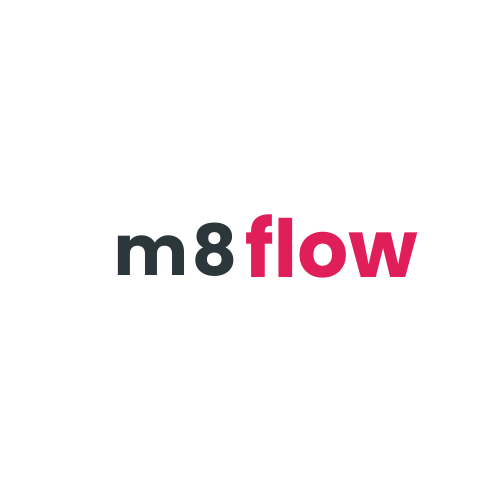
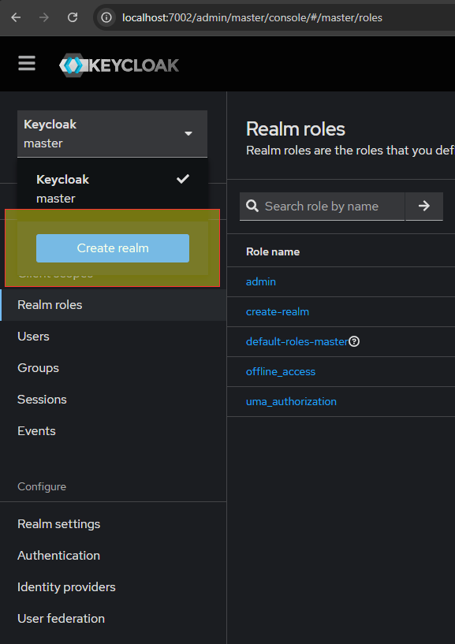
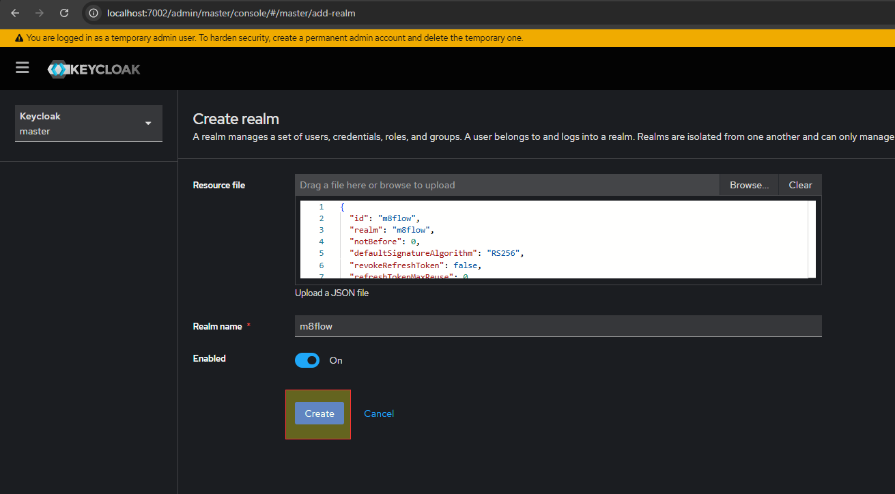
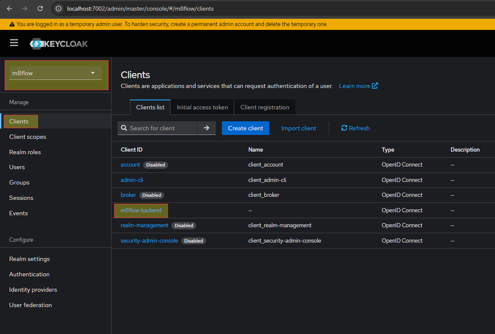
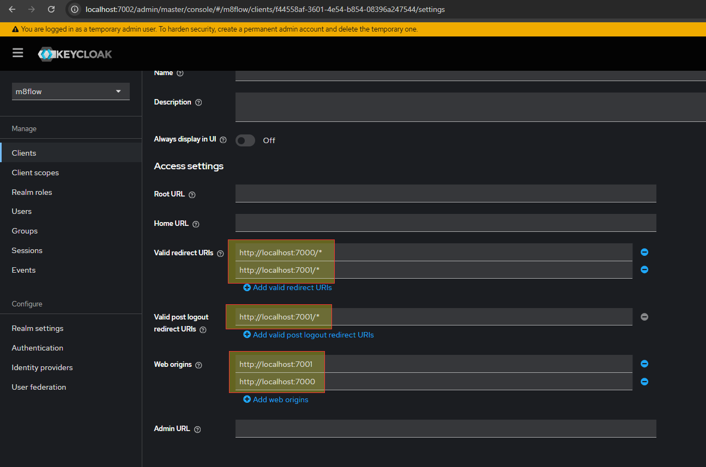
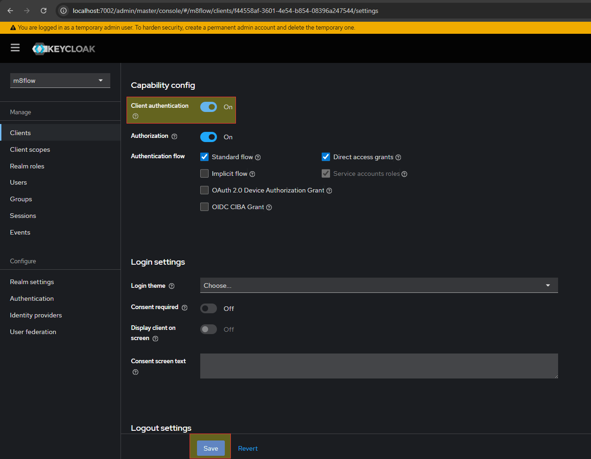
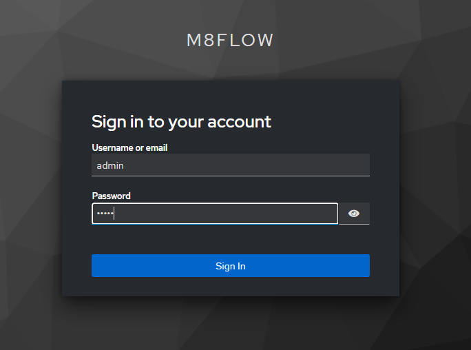
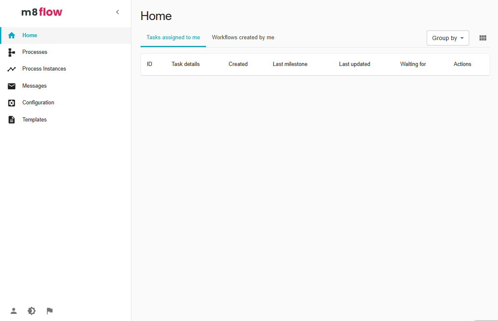

# m8flow v0.8 — Python-based workflow engine
<div align="center">
    
</div>

**m8flow** is an open-source workflow engine implemented in pure Python.  
It is built on the proven foundation of SpiffWorkflow, with a vision shaped by **8 guiding principles** for flow orchestration:

**Merge flows effectively** – streamline complex workflows  
**Make apps faster** – speed up development and deployment  
**Manage processes better** – bring structure and clarity to execution  
**Minimize errors** – reduce mistakes through automation  
**Maximize efficiency** – get more done with fewer resources  
**Model workflows visually** – design with simplicity and clarity  
**Modernize systems** – upgrade legacy processes seamlessly  
**Mobilize innovation** – empower teams to build and experiment quickly  

---

## Why m8flow?

**Future-proof alternative** → replaces Camunda 7 with a modern, Python-based workflow engine  
**Enterprise-grade integrations** → tight alignment with **formsflow.ai**, **caseflow**, and the **SLED360** automation suite  
**Open and extensible** → open source by default, extensible for enterprise-grade use cases  
**Principles-first branding** → “m8” = 8 principles for flow, consistent with the product family (caseflow, formsflow.ai)  
**Visual and symbolic meaning**:  
  - “8 nodes” in automation  
  - “8” resembles a curled Python → Python-native identity  
  - “m8” → mate / mighty → collaboration and strength  

---

## Features

**BPMN 2.0**: pools, lanes, multi-instance tasks, sub-processes, timers, signals, messages, boundary events, loops  
**DMN**: baseline implementation integrated with the Python execution engine  
**Forms support**: extract form definitions (Camunda XML extensions → JSON) for CLI or web UI generation  
**Python-native workflows**: run workflows via Python code or JSON structures  
**Integration-ready**: designed to plug into formsflow, caseflow, decision engines, and enterprise observability tools  

_A complete list of the latest features is available in our [release notes](https://github.com/AOT-Technologies/m8flow/releases)._  

---

## M8Flow Local Installation Guide

This document describes how to run M8Flow locally for testing and development purposes using Docker for infrastructure.

---

## Pre-requisites

Ensure the following tools are installed:

- Git  
- Docker and Docker Compose  


The project repository:

https://github.com/AOT-Technologies/m8flow

---

## Clone Repository and Configure Environment

Clone the repository and move into the project directory:

```bash
git clone https://github.com/AOT-Technologies/m8flow.git
cd m8flow
```

A sample environment file is provided at the repository root. Create a working environment file:

```bash
cp sample.env .env
```

Edit the `.env` file if adjustments are required for the local setup.

---

### Backend with m8flow extensions (tenant APIs, etc.)

To run the **extensions app** (m8flow backend: tenant login URL, tenant APIs, and DB migrations for m8flow):

1. Ensure `.env` at repo root has `M8FLOW_BACKEND_DATABASE_URI`. Optionally set `M8FLOW_BACKEND_UPGRADE_DB=true` to run SpiffWorkflow DB migrations before start. Other options: `M8FLOW_BACKEND_RUN_BOOTSTRAP=false`, `SPIFFWORKFLOW_BACKEND_RUN_DATA_SETUP` (see sample.env).
2. From repo root, run backend and frontend together (backend in background):

```bash
./start_dev.sh
```

Backend runs on port **7000** (override with `M8FLOW_BACKEND_PORT`), frontend on **7001**. For backend-only (e.g. in a separate terminal), run from repo root: `cd spiffworkflow-backend && uv sync`; if `M8FLOW_BACKEND_UPGRADE_DB=true`, run `uv run flask db upgrade`; then `export PYTHONPATH="$PWD/..:$PWD/../extensions/m8flow-backend/src:$PWD/src"` and `uv run uvicorn extensions.app:app --reload --host 0.0.0.0 --port ${M8FLOW_BACKEND_PORT:-7000}`.

**Mac Port Errors**: On a Mac, port 7000 (used by the backend) might be hijacked by Airplay. For those who upgraded to macOS 12.1 and are running everything locally, your AirPlay receiver may have started on Port 7000 and your server (which uses port 7000 by default) may fail due to this port already being used. You can disable this port in System Preferences > Sharing > AirPlay receiver.

## Determine Local IP Address

For reliable networking between browser, Docker containers, and local services, use the machine's LAN IP address instead of `localhost`.

Example:

```
192.168.1.105
```

This IP address will be used in Keycloak configuration and when accessing frontend and backend services.

---

## Start Infrastructure with Docker

Start all required infrastructure services (databases, Keycloak, MinIO, etc.) and init containers (important for the first time):

```bash
docker compose --profile init -f docker/m8flow-docker-compose.yml up -d --build
```

If the init containers are not needed:

```bash
docker compose -f docker/m8flow-docker-compose.yml up -d --build
```

The Keycloak image is built with the **m8flow realm-info-mapper** provider, so tokens include `m8flow_tenant_id` and `m8flow_tenant_name`. No separate build of the keycloak-extensions JAR is required. Realm import can be done manually in the Keycloak Admin Console (see Keycloak Setup below) or by running `./extensions/m8flow-backend/keycloak/start_keycloak.sh` once after Keycloak is up; the script imports the identity realm and creates tenant-a (expects Keycloak on ports 7002 and 7009, e.g. when using Docker Compose).

To stop containers and remove associated volumes (this deletes local database data):

```bash
docker compose -f docker/m8flow-docker-compose.yml down -v
```

---

## Quick Start Summary

Alternatively you can run the commands below to start M8Flow docker containers:

Linux:
```bash
git clone https://github.com/AOT-Technologies/m8flow.git
cd m8flow
cp sample.env .env
IP="$(ip route get 1.1.1.1 2>/dev/null | awk '{for(i=1;i<=NF;i++) if($i=="src"){print $(i+1); exit}}')" && \
[ -n "$IP" ] && grep -q "<LOCAL_IP>" .env && sed -i.bak "s/<LOCAL_IP>/$IP/g" .env && echo "Using IP=$IP"
docker compose --profile init -f docker/m8flow-docker-compose.yml up -d --build

```

Windows CMD:
```bat
git clone https://github.com/AOT-Technologies/m8flow.git
cd m8flow
copy sample.env .env
powershell -NoProfile -Command "$ifIndex=(Get-NetRoute '0.0.0.0/0' | sort RouteMetric,InterfaceMetric | select -First 1).IfIndex; $ip=(Get-NetIPAddress -AddressFamily IPv4 -InterfaceIndex $ifIndex | ?{ $_.IPAddress -notlike '169.254*' -and $_.IPAddress -notlike '127.*' } | select -First 1 -Expand IPAddress); $c=Get-Content .env -Raw; $n=$c -replace '<LOCAL_IP>', $ip; if($n -eq $c){ throw 'No <LOCAL_IP> tokens found in .env' }; $n | Set-Content .env -Encoding UTF8; Write-Host Using IP=$ip"
docker compose --profile init -f docker/m8flow-docker-compose.yml up -d --build

```

After the containers start, continue below to the Keycloak Setup to import the realm and configure the client.

---

## Keycloak Setup

### Import Realm

You can import realms manually as below, or run `./extensions/m8flow-backend/keycloak/start_keycloak.sh` after starting Docker to import the identity realm and tenant-a.

In the Keycloak Admin Console http://localhost:7002/ log in using the configured administrator credentials.

Click on "Keycloak master" and then on "Create a realm".

<div align="center">
    
</div>

Browse or copy the content of `extensions/m8flow-backend/keycloak/realm_exports/m8flow-rbac-realm.json` and click on "Create". For tenant-aware setup this realm includes token claims `m8flow_tenant_id` and `m8flow_tenant_name`.
<div align="center">
    
</div>

### Configure Client

With the realm "spiffworkflow" selected, click on "Clients" and then on the client ID **spiffworkflow-backend**.
<div align="center">
    
</div>

Set the following:

**Valid redirect URIs**
```
http://<LOCAL_IP>:8000/*
http://<LOCAL_IP>:8001/*
```

**Valid post logout redirect URIs**
```
http://<LOCAL_IP>:8000/*
http://<LOCAL_IP>:8001/*
```
<div align="center">
    
</div>

Disable **Client authentication**.
<div align="center">
    
</div>

---

## Running Backend locally

Create a virtual environment and activate it:

```sh
python -m venv .venv
source .venv/bin/activate
```

Install uv and all the dependencies:
```sh
pip install --upgrade pip  && pip install uv
cd spiffworkflow-backend
uv sync --all-groups --active
cd ..
```

To have the backend running locally, use `./start_dev.sh` from the repo root (starts backend and frontend). For backend-only, see the "Backend with m8flow extensions" section above.

You can test the backend with:

`curl http://localhost:7000/v1.0/status`

The result should be:

```json
{
  "ok": true,
  "can_access_frontend": true
}
```

---

## Running Backend tests

Running all tests:

`pytest -c spiffworkflow-backend/pyproject.toml ./extensions/m8flow-backend/tests/ -q`


Running a specific test:

`pytest -c spiffworkflow-backend/pyproject.toml ./extensions/m8flow-backend/tests/unit/m8flow_backend/services/test_tenant_context_middleware.py -q`

---

## Access the application 

Open `http://<LOCAL_IP>:8001/` on your browser and you are going to be redirected to keycloak authentication. Now use of the test users (password is same as username):

- super-admin
- tenant-admin
- editor
- viewer
- integrator
- reviewer

<div align="center">
    
</div>

Now you can user M8Flow:
<div align="center">
    
</div>
--- 

## Contribute

We welcome contributions from the community!

  - Submit PRs with passing tests and clear references to issues  

  ---

## Credits

m8flow builds upon the outstanding work of the **SpiffWorkflow community** and contributors over the past decade. We extend gratitude to:

  - Samuel Abels (@knipknap), Matthew Hampton (@matthewhampton)
  - The University of Virginia & early BPMN/DMN contributors
  - The BPMN.js team, Bruce Silver, and the wider open-source workflow community
  - Countless contributors past and present  

---

## License

m8flow is released under the **GNU Lesser General Public License (LGPL)**.