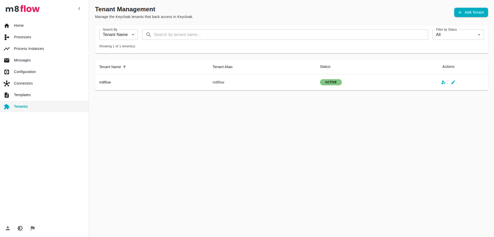

# m8flow — Python-based workflow engine
<div align="center">
    
</div>

**m8flow** is an open-source workflow engine implemented in pure Python.
It is built on the proven foundation of SpiffWorkflow, with a vision shaped by **8 guiding principles** for flow orchestration:

**Merge flows effectively** – streamline complex workflows
**Make apps faster** – speed up development and deployment
**Manage processes better** – bring structure and clarity to execution
**Minimize errors** – reduce mistakes through automation
**Maximize efficiency** – get more done with fewer resources
**Model workflows visually** – design with simplicity and clarity
**Modernize systems** – upgrade legacy processes seamlessly
**Mobilize innovation** – empower teams to build and experiment quickly

---

## Why m8flow?

**Future-proof alternative** →  A modern, Python-based workflow engine that can serve as a strong option alongside platforms like Camunda 7

**Enterprise-grade integrations** → tight alignment with **formsflow.ai**, **caseflow**, and the **SLED360** automation suite

**Open and extensible** → open source by default, extensible for enterprise-grade use cases

**Principles-first branding** → "m8" = 8 principles for flow, consistent with the product family (caseflow, formsflow.ai)

---

## Features

**BPMN 2.0**: pools, lanes, multi-instance tasks, sub-processes, timers, signals, messages, boundary events, loops
**DMN**: baseline implementation integrated with the Python execution engine
**Forms support**: extract form definitions (Camunda XML extensions → JSON) for CLI or web UI generation
**Python-native workflows**: run workflows via Python code or JSON structures
**Integration-ready**: designed to plug into formsflow, caseflow, decision engines, and enterprise observability tools

_A complete list of the latest features is available in our [release notes](https://github.com/AOT-Technologies/m8flow/releases)._


---
## Pre-requisites

Ensure the following tools are installed:

- Git
- Docker and Docker Compose
- Python 3.12.1 and [uv](https://docs.astral.sh/uv/) _(for local backend development only)_
- Node.js 20.19+ or 22.12+ and npm _(for local frontend development only)_

---

## Quick Start Guide

Getting started with m8flow is simple! Follow the steps below to set up your local environment and launch the platform.

### 1. Clone the Repository

First, clone the repository from GitHub and navigate into the project directory:

```bash
git clone https://github.com/AOT-Technologies/m8flow.git
cd m8flow
```

### 2. Set Up Your Environment

Copy the provided environment template and customize it for your setup:

```bash
cp sample.env .env
```

You can find comprehensive environment variable explanations in the [docs/env-reference.md](docs/env-reference.md) file.

---

### 3. Start m8flow with Docker

To bring up all required services (PostgreSQL, Keycloak, MinIO, Redis, NATS, and initialization steps), run:

```bash
docker compose --profile init -f docker/m8flow-docker-compose.yml up -d --build
```

> **Note:** Run the above command only the first time to perform initialization. For future starts, skip the init profile:

```bash
docker compose -f docker/m8flow-docker-compose.yml up -d --build
```

Once started, open [http://localhost:7001/](http://localhost:7001/) in your browser to access m8flow.

---

## Signing In — Application Usage

1. **Tenant Selection:**  
   When you visit the application, you'll be prompted to select or enter your tenant slug. By default, the tenant `m8flow` will be available for you to use.

   <div align="center">
       
   </div>

2. **Log In:**  
   After choosing your tenant, you'll be redirected to the login page.

   <div align="center">
       
   </div>


3. **Try the Default Test Users:**  
   Each tenant comes with a set of default test users for you to explore the platform. **_The password for each user is the same as their username._**

   | Username     | Role                                  |
   |--------------|---------------------------------------|
   | `admin`      | Tenant administrator                  |
   | `editor`     | Create and edit process models        |
   | `viewer`     | Read-only access                      |
   | `integrator` | Service task / connector access       |
   | `reviewer`   | Review and approve tasks              |


You’re all set! Continue with [Tenant creation](#tenant-creation) to add your own tenants or explore the rich features of m8flow.

---

## Tenant creation

1. **Open the Application:**  
   Go to [http://localhost:7001/](http://localhost:7001/) in your web browser.

2. **Sign in as Global Admin:**  
   Click on **"Global admin sign in"**.  
   <div align="center">
      
   </div>

   Log in using the following credentials:
   ```
   Username: super-admin
   Password: super-admin
   ```

3. **Add a Tenant:**  
   After signing in, click the **"Add tenant"** button to create a new tenant.

    <div align="center">
        
    </div>

   Once your tenant is created, it will automatically include the set of default test users described above in [Try the Default Test Users](#try-the-default-test-users).  
 
---

## Docker Compose services

The Keycloak image is built with the **m8flow realm-info-mapper** provider, so tokens include `m8flow_tenant_id` and `m8flow_tenant_name`. No separate build of the keycloak-extensions JAR is required. Realm import can be done manually in the Keycloak Admin Console (see Keycloak Setup below) or by running `./m8flow-backend/keycloak/start_keycloak.sh` once after Keycloak is up; the script imports the `m8flow` realm only (expects Keycloak on ports 7002 and 7009, e.g. when using Docker Compose).

| Service | Description | Port |
|---------|-------------|------|
| `m8flow-db` | PostgreSQL — m8flow application database | 1111 |
| `keycloak-db` | PostgreSQL — Keycloak database | — |
| `keycloak` | Keycloak identity provider (with m8flow realm mapper) | 7002, 7009 |
| `keycloak-proxy` | Nginx proxy in front of Keycloak | 7002 |
| `redis` | Redis — Celery broker and cache | 6379 |
| `nats` | NATS messaging server _(optional profile)_ | 4222 |
| `minio` | MinIO object storage (process models, templates) | 9000, 9001 |
| `m8flow-backend` | SpiffWorkflow backend + m8flow extensions | 7000 |
| `m8flow-frontend` | SpiffWorkflow frontend + m8flow extensions | 7001 |
| `m8flow-connector-proxy` | m8flow connector proxy (SMTP, Slack, HTTP, etc.) | 8004 |
| `m8flow-celery-worker` | Celery background task worker | — |
| `m8flow-celery-flower` | Celery monitoring UI | 5555 |
| `m8flow-nats-consumer` | NATS event consumer | — |

**Init-only services** (run once via `--profile init`):

| Service | Purpose |
|---------|---------|
| `fetch-upstream` | Fetches upstream spiff-arena code into the working tree |
| `keycloak-master-admin-init` | Sets up Keycloak master realm admin |
| `minio-mc-init` | Creates MinIO buckets (`m8flow-process-models`, `m8flow-templates`) |
| `process-models-sync` | Syncs process models into MinIO |
| `templates-sync` | Syncs templates into MinIO |

### Stop and clean up

```bash
# Stop containers (preserves volumes)
docker compose -f docker/m8flow-docker-compose.yml down

# Stop and delete all data volumes
docker compose -f docker/m8flow-docker-compose.yml down -v
```


---
## Sample Templates

m8flow includes sample workflow templates that can help teams get started quickly with common approval, notification, escalation, and integration scenarios.

The sample templates package includes pre-built workflows and guidance for:

- automatically loading templates during startup
- using integration-focused templates such as Salesforce, Slack, SMTP, and PostgreSQL examples

For the full template catalog and setup instructions, refer to [m8flow-backend/sample_templates/README.md](m8flow-backend/sample_templates/README.md).

---

## Integration Services

m8flow includes supporting services for connector execution and event-driven workflow processing. These components can be run alongside the core platform depending on your deployment needs.

For service-specific setup, configuration, and usage details, refer to:

- [m8flow-connector-proxy/README.md](m8flow-connector-proxy/README.md) for connector proxy support such as SMTP, Slack, HTTP, and related integrations
- [m8flow-nats-consumer/README.md](m8flow-nats-consumer/README.md) for NATS-based event consumption and event-driven workflow execution

---

## Additional Documentation & Developer Resources

For details on active development of backend/frontend workflows without docker,  and other development topics, refer to [docs/README.md](docs/README.md). More guides and references are available in the `docs/` folder as the documentation expands.

---

## Contribute

We welcome contributions from the community!

- Submit PRs with passing tests and clear references to issues

---

## License note

m8flow is released under the **Apache License 2.0**. See the [LICENSE](LICENSE) file for the full text.

The upstream [AOT-Technologies/m8flow-core](https://github.com/AOT-Technologies/m8flow-core) code (LGPL-2.1) is **not stored in this repository**. It is fetched on demand via `bin/fetch-upstream.sh` or `bin/fetch-upstream.ps1` and gitignored so that it never enters the m8flow commit history. This keeps the licence boundaries cleanly separated while still allowing the app to run against the upstream SpiffWorkflow engine.
