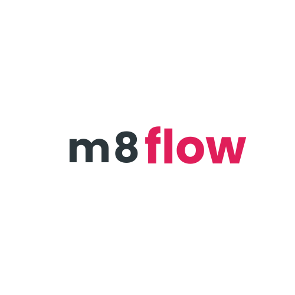
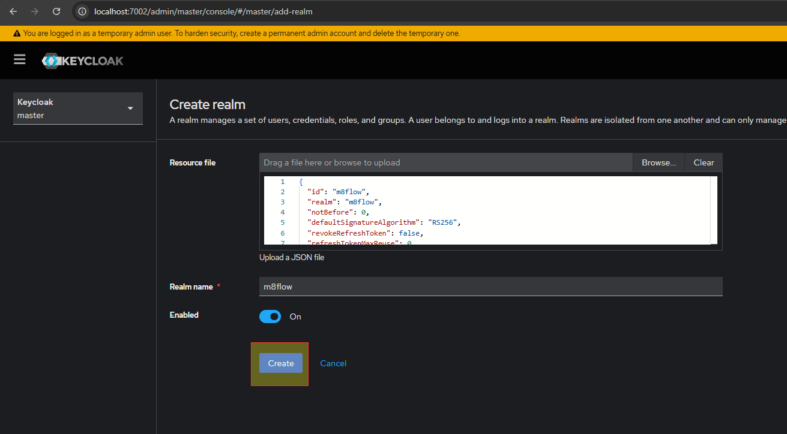
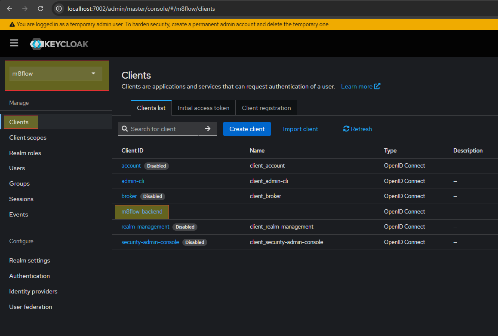
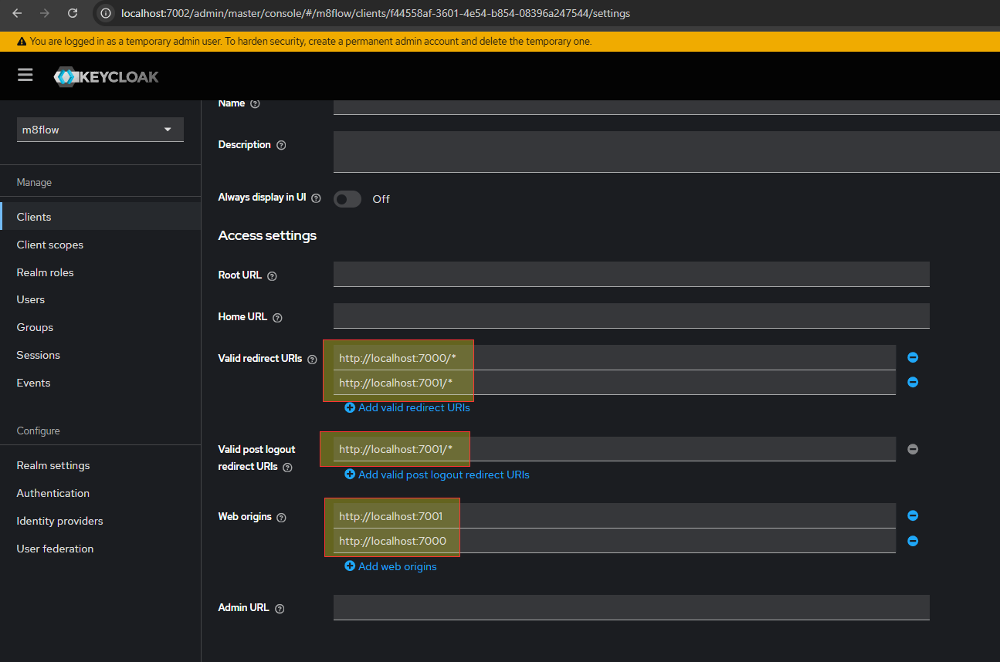
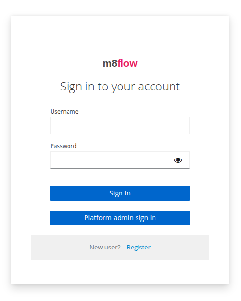
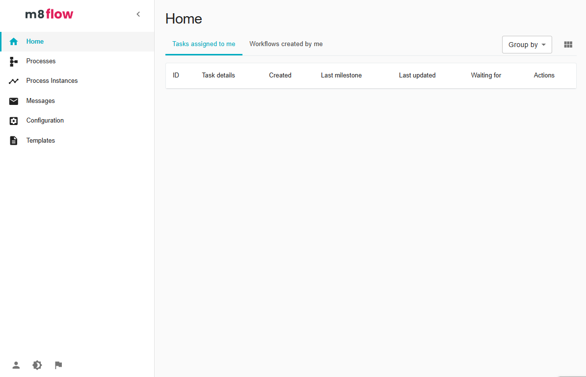
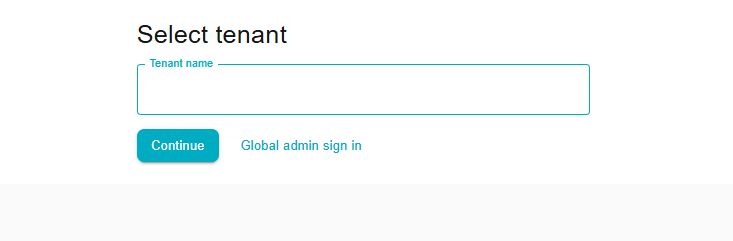
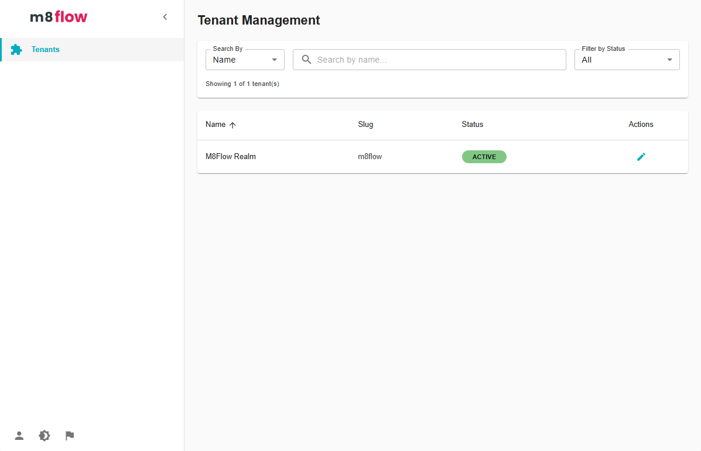

# m8flow — Python-based workflow engine
<div align="center">
    
</div>

**m8flow** is an open-source workflow engine implemented in pure Python.
It is built on the proven foundation of SpiffWorkflow, with a vision shaped by **8 guiding principles** for flow orchestration:

**Merge flows effectively** – streamline complex workflows
**Make apps faster** – speed up development and deployment
**Manage processes better** – bring structure and clarity to execution
**Minimize errors** – reduce mistakes through automation
**Maximize efficiency** – get more done with fewer resources
**Model workflows visually** – design with simplicity and clarity
**Modernize systems** – upgrade legacy processes seamlessly
**Mobilize innovation** – empower teams to build and experiment quickly

---

## Why m8flow?

**Future-proof alternative** →  A modern, Python-based workflow engine that can serve as a strong option alongside platforms like Camunda 7

**Enterprise-grade integrations** → tight alignment with **formsflow.ai**, **caseflow**, and the **SLED360** automation suite

**Open and extensible** → open source by default, extensible for enterprise-grade use cases

**Principles-first branding** → "m8" = 8 principles for flow, consistent with the product family (caseflow, formsflow.ai)

---

## Features

**BPMN 2.0**: pools, lanes, multi-instance tasks, sub-processes, timers, signals, messages, boundary events, loops
**DMN**: baseline implementation integrated with the Python execution engine
**Forms support**: extract form definitions (Camunda XML extensions → JSON) for CLI or web UI generation
**Python-native workflows**: run workflows via Python code or JSON structures
**Integration-ready**: designed to plug into formsflow, caseflow, decision engines, and enterprise observability tools

_A complete list of the latest features is available in our [release notes](https://github.com/AOT-Technologies/m8flow/releases)._

---

## Repository Structure

```
m8flow/
├── bin/                          # Developer helper scripts
│   ├── fetch-upstream.sh         # Fetch upstream source folders on demand (Bash)
│   ├── fetch-upstream.ps1        # Fetch upstream source folders on demand (PowerShell)
│   └── diff-from-upstream.sh     # Report local vs upstream divergence
│
├── docker/                       # All Docker and Compose files
│   ├── m8flow-docker-compose.yml         # Primary local dev stack
│   ├── m8flow-docker-compose.prod.yml    # Production overrides
│   ├── m8flow.backend.Dockerfile
│   ├── m8flow.frontend.Dockerfile
│   ├── m8flow.keycloak.Dockerfile
│   ├── minio.local-dev.docker-compose.yml
│   └── minio.production.docker-compose.yml
│
├── docs/                         # Documentation and images
│   └── env-reference.md          # Canonical environment variable reference
│
├── extensions/                   # m8flow-specific extensions (Apache 2.0)
│   ├── app.py                    # Extensions Flask/ASGI entry point
│   ├── m8flow-backend/           # Tenant APIs, auth middleware, DB migrations
│   │   ├── bin/                  # Backend run/migration scripts
│   │   ├── keycloak/             # Realm exports and Keycloak setup scripts
│   │   ├── migrations/           # Alembic migrations for m8flow tables
│   │   ├── src/m8flow_backend/   # Extension source code
│   │   └── tests/
│   └── m8flow-frontend/          # Multi-tenant UI extensions
│       └── src/
│
├── keycloak-extensions/          # Keycloak realm-info-mapper provider (JAR)
│
├── m8flow-connector-proxy/       # m8flow connector proxy service (Apache 2.0)
│
├── m8flow-nats-consumer/         # NATS event consumer service
│
├── upstream.sources.json         # Canonical upstream repo/ref/folder config
├── sample.env                    # Environment variable template
└── LICENSE                       # Apache License 2.0

# ── Gitignored — fetched via bin/fetch-upstream.sh / bin/fetch-upstream.ps1 ─
# spiffworkflow-backend/          Upstream LGPL-2.1 workflow engine
# spiffworkflow-frontend/         Upstream LGPL-2.1 BPMN modeler UI
# spiff-arena-common/             Upstream LGPL-2.1 shared utilities
```

> **Why are those directories missing?**
> `spiffworkflow-backend`, `spiffworkflow-frontend`, and `spiff-arena-common` come from [AOT-Technologies/m8flow-core](https://github.com/AOT-Technologies/m8flow-core) (LGPL-2.1). They are not stored here to keep m8flow's Apache 2.0 licence boundary clean. Run `./bin/fetch-upstream.sh` or `.\bin\fetch-upstream.ps1` once after cloning to populate them. See the [License note](#license-note) for details.

---

## Pre-requisites

Ensure the following tools are installed:

- Git
- Docker and Docker Compose
- Python 3.12.1 and [uv](https://docs.astral.sh/uv/) _(for local backend development only)_
- Node.js 18+ and npm _(for local frontend development only)_

---

## Clone and Set Up

### 1. Clone the repository

```bash
git clone https://github.com/AOT-Technologies/m8flow.git
cd m8flow
```

### 2. Fetch the upstream SpiffWorkflow code

The upstream LGPL-2.1 engine is not stored in this repo.

**Docker builds are self-contained** — the Dockerfiles automatically fetch upstream from GitHub during the build, so no local pre-fetch is needed for `docker compose up --build`.


This clones configured folders from [AOT-Technologies/m8flow-core](https://github.com/AOT-Technologies/m8flow-core) into your working tree. Folder lists are defined in `upstream.sources.json` under `backend`, `frontend`, and `others`. These directories are gitignored and must be re-fetched after every fresh clone.

To pin a specific upstream tag (Docker):

# Docker build (set in .env or inline)
UPSTREAM_TAG=0.0.1 docker compose -f docker/m8flow-docker-compose.yml up -d --build
```
# Docker build (set in .env or inline)
$env:UPSTREAM_TAG = "0.0.1"
docker compose -f docker/m8flow-docker-compose.yml up -d --build
```

### 3. Configure environment

Copy the sample environment file and edit it for your setup:

```bash
cp sample.env .env
```

Full environment variable documentation: [docs/env-reference.md](docs/env-reference.md).

---

## Running with Docker

### Start the full stack

Start all infrastructure services (database, Keycloak, MinIO, Redis, NATS) and init containers (run once on first setup):

```bash
docker compose --profile init -f docker/m8flow-docker-compose.yml up -d --build
```

On subsequent starts, skip the init profile:

```bash
docker compose -f docker/m8flow-docker-compose.yml up -d --build
```

### Docker Compose services

The Keycloak image is built with the **m8flow realm-info-mapper** provider, so tokens include `m8flow_tenant_id` and `m8flow_tenant_name`. No separate build of the keycloak-extensions JAR is required. Realm import can be done manually in the Keycloak Admin Console (see Keycloak Setup below) or by running `./extensions/m8flow-backend/keycloak/start_keycloak.sh` once after Keycloak is up; the script imports the `m8flow` realm only (expects Keycloak on ports 7002 and 7009, e.g. when using Docker Compose).

| Service | Description | Port |
|---------|-------------|------|
| `m8flow-db` | PostgreSQL — m8flow application database | 1111 |
| `keycloak-db` | PostgreSQL — Keycloak database | — |
| `keycloak` | Keycloak identity provider (with m8flow realm mapper) | 7002, 7009 |
| `keycloak-proxy` | Nginx proxy in front of Keycloak | 7002 |
| `redis` | Redis — Celery broker and cache | 6379 |
| `nats` | NATS messaging server _(optional profile)_ | 4222 |
| `minio` | MinIO object storage (process models, templates) | 9000, 9001 |
| `m8flow-backend` | SpiffWorkflow backend + m8flow extensions | 7000 |
| `m8flow-frontend` | SpiffWorkflow frontend + m8flow extensions | 7001 |
| `m8flow-connector-proxy` | m8flow connector proxy (SMTP, Slack, HTTP, etc.) | 8004 |
| `m8flow-celery-worker` | Celery background task worker | — |
| `m8flow-celery-flower` | Celery monitoring UI | 5555 |
| `m8flow-nats-consumer` | NATS event consumer | — |

**Init-only services** (run once via `--profile init`):

| Service | Purpose |
|---------|---------|
| `fetch-upstream` | Fetches upstream spiff-arena code into the working tree |
| `keycloak-master-admin-init` | Sets up Keycloak master realm admin |
| `minio-mc-init` | Creates MinIO buckets (`m8flow-process-models`, `m8flow-templates`) |
| `process-models-sync` | Syncs process models into MinIO |
| `templates-sync` | Syncs templates into MinIO |

### Stop and clean up

```bash
# Stop containers (preserves volumes)
docker compose -f docker/m8flow-docker-compose.yml down

# Stop and delete all data volumes
docker compose -f docker/m8flow-docker-compose.yml down -v
```

---

## Running Locally (without Docker for backend/frontend)

Use this mode for active development of m8flow extensions.

### 1. Start infrastructure services

Start only the infrastructure (database, Keycloak, MinIO, Redis) as containers:

```bash
docker compose --profile init -f docker/m8flow-docker-compose.yml up -d --build \
  m8flow-db keycloak-db keycloak keycloak-proxy redis minio minio-mc-init
```

### 2. Start backend and frontend

Start the backend in one terminal:

```bash
./extensions/m8flow-backend/bin/run_m8flow_backend.sh 7000 --reload
```

```powershell
.\extensions\m8flow-backend\bin\run_m8flow_backend.ps1 7000 --Reload
```

When `uv` is available locally, the backend launcher syncs backend dependencies automatically before starting and runs the backend through `uv`. Set `M8FLOW_BACKEND_SYNC_DEPS=false` to skip sync, or `M8FLOW_BACKEND_USE_UV=false` to use the current Python environment directly.

Start the frontend in a second terminal:

Install frontend dependencies first if you have not already done so for this checkout:

```bash
cd extensions/m8flow-frontend
npm install
```

```bash
cd extensions/m8flow-frontend
export PORT=7001
export BACKEND_PORT=7000
export VITE_VERSION_INFO='{"version":"local"}'
export VITE_BACKEND_BASE_URL=/v1.0
export VITE_MULTI_TENANT_ON="${MULTI_TENANT_ON:-false}"
npm exec -- vite --host 0.0.0.0 --port 7001
```

```powershell
Set-Location .\extensions\m8flow-frontend
$env:PORT = '7001'
$env:BACKEND_PORT = '7000'
$env:VITE_VERSION_INFO = '{"version":"local"}'
$env:VITE_BACKEND_BASE_URL = '/v1.0'
$env:VITE_MULTI_TENANT_ON = if ($env:MULTI_TENANT_ON) { $env:MULTI_TENANT_ON } else { 'false' }
npm exec -- vite --host 0.0.0.0 --port 7001
```

This flow expects the Docker dependencies to be running, but not the Docker `m8flow-backend` or `m8flow-frontend` services on the same ports. If those containers are still up, stop them before launching the local dev servers.

Docker bind-mounts the repo `process_models/` directory into the backend and Celery containers, so a locally started backend and a containerized worker read the same process-model files by default.

If the frontend fails with a missing Rollup native package such as `@rollup/rollup-win32-x64-msvc`, reinstall `extensions/m8flow-frontend` dependencies on that machine with `npm install`.

> **macOS note:** Port 7000 may be claimed by AirPlay Receiver. Disable it in
> System Settings → General → AirDrop & Handoff → AirPlay Receiver.

### 3. Verify the backend

```bash
curl http://localhost:7000/v1.0/status
```

Expected response:
```json
{ "ok": true, "can_access_frontend": true }
```

### Running backend only

```bash
./extensions/m8flow-backend/bin/run_m8flow_backend.sh
```

```powershell
.\extensions\m8flow-backend\bin\run_m8flow_backend.ps1
```

### Running a Celery worker

```bash
./extensions/m8flow-backend/bin/run_m8flow_celery_worker.sh
```

---

## Keycloak Setup

### Automatic import 

On starting the application with [Running with Docker](#running-with-docker) will import default realm "m8flow". Tenant realms are created later via the tenant realm API when needed.

For tenant-aware setup this realm includes token claims `m8flow_tenant_id` and `m8flow_tenant_name`.
<div align="center">
    
</div>

### Configure the client redirect URIs

With the realm "m8flow" selected, click on "Clients" and then on the client ID **m8flow-backend**.
<div align="center">
    
</div>

Set the following:

**Valid redirect URIs**
```
http://localhost:7000/*
http://localhost:7001/*
```

**Valid post logout redirect URIs**
```
http://localhost:7001/*
```

**Web origins**
```
http://localhost:7001/*
http://localhost:7000/*
```

<div align="center">
    
</div>


For full Keycloak configuration reference: [extensions/m8flow-backend/keycloak/KEYCLOAK_SETUP.md](extensions/m8flow-backend/keycloak/KEYCLOAK_SETUP.md).

---

## Access the Application with no multitenancy

Open `http://localhost:7001/` in your browser. You will be redirected to Keycloak login.

<div align="center">
    
</div>

<div align="center">
    
</div>

Default test users (password = username):

| Username | Role |
|----------|------|
| `admin` | Administrator |
| `editor` | Create and edit process models |
| `viewer` | Read-only access |
| `integrator` | Service task / connector access |
| `reviewer` | Review and approve tasks |

---

## Access the Application with multitenancy

Open `http://localhost:7001/` in your browser. You will be redirected to Tenant selector. Type the tenant slug, e.g.: "m8flow" (installed by default) and then you will be redirected to the tenant login.

<div align="center">
    
</div>

<div align="center">
    
</div>

<div align="center">
    
</div>


Every tenant has default test users (password = username):

| Username | Role |
|----------|------|
| `admin` | Tenant administrator |
| `editor` | Create and edit process models |
| `viewer` | Read-only access |
| `integrator` | Service task / connector access |
| `reviewer` | Review and approve tasks |

---


### Tenant Management

Open `http://localhost:7001/` in your browser. You will be redirected to Tenant selector. Click on "Global admin sign in"

<div align="center">
    
</div>

There's only one user (password = username):

| Username | Role |
|----------|------|
| `super-admin` | Tenants management |

## Tenant creation

Currently, tenant creation can be done using the `http://localhost:7000/v1.0/m8flow/tenant-realms` API. This request requires a `Bearer` token for the `super-admin` user.

Example request payload:

```json
{
  "realm_id": "myapp",
  "display_name": "My application"
}
```

On success, the tenant will be listed on the tenant management page and will be ready to use through the multitenant access flow described in [Access the Application with multitenancy](#access-the-application-with-multitenancy).

<div align="center">
    
</div>

---

## Running Backend Tests

Requires `./bin/fetch-upstream.sh` or `.\bin\fetch-upstream.ps1` to have been run first — tests use `spiffworkflow-backend/pyproject.toml` for pytest config.

Run all tests:

```bash
pytest -c spiffworkflow-backend/pyproject.toml ./extensions/m8flow-backend/tests/ -q
```

Run a specific test file:

```bash
pytest -c spiffworkflow-backend/pyproject.toml \
  ./extensions/m8flow-backend/tests/unit/m8flow_backend/services/test_tenant_context_middleware.py -q
```

---

## Sample Templates

m8flow includes sample workflow templates that can help teams get started quickly with common approval, notification, escalation, and integration scenarios.

The sample templates package includes pre-built workflows and guidance for:

- automatically loading templates during startup
- using integration-focused templates such as Salesforce, Slack, SMTP, and PostgreSQL examples

For the full template catalog and setup instructions, refer to [extensions/m8flow-backend/sample_templates/README.md](extensions/m8flow-backend/sample_templates/README.md).

---

## Integration Services

m8flow includes supporting services for connector execution and event-driven workflow processing. These components can be run alongside the core platform depending on your deployment needs.

For service-specific setup, configuration, and usage details, refer to:

- [m8flow-connector-proxy/README.md](m8flow-connector-proxy/README.md) for connector proxy support such as SMTP, Slack, HTTP, and related integrations
- [m8flow-nats-consumer/README.md](m8flow-nats-consumer/README.md) for NATS-based event consumption and event-driven workflow execution

---

## Production Deployment

See [docker/DEPLOYMENT.md](docker/DEPLOYMENT.md) for production compose and hardening guidance.

### Production MinIO

A dedicated MinIO compose file with pinned image, restart policy, and resource limits:

```bash
# MinIO only
docker compose -f docker/minio.production.docker-compose.yml up -d

# MinIO with the full stack
docker compose -f docker/m8flow-docker-compose.yml \
               -f docker/minio.production.docker-compose.yml up -d

# With bucket init
docker compose --profile init \
               -f docker/m8flow-docker-compose.yml \
               -f docker/minio.production.docker-compose.yml up -d
```

Set `MINIO_ROOT_USER` and `MINIO_ROOT_PASSWORD` in `.env` (no defaults in the production file).

---

## Contribute

We welcome contributions from the community!

- Submit PRs with passing tests and clear references to issues

---

## License note

m8flow is released under the **Apache License 2.0**. See the [LICENSE](LICENSE) file for the full text.

The upstream [AOT-Technologies/m8flow-core](https://github.com/AOT-Technologies/m8flow-core) code (LGPL-2.1) is **not stored in this repository**. It is fetched on demand via `bin/fetch-upstream.sh` or `bin/fetch-upstream.ps1` and gitignored so that it never enters the m8flow commit history. This keeps the licence boundaries cleanly separated while still allowing the app to run against the upstream SpiffWorkflow engine.
