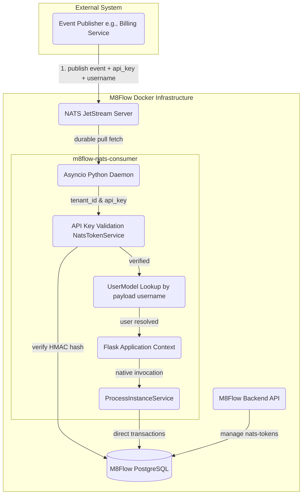
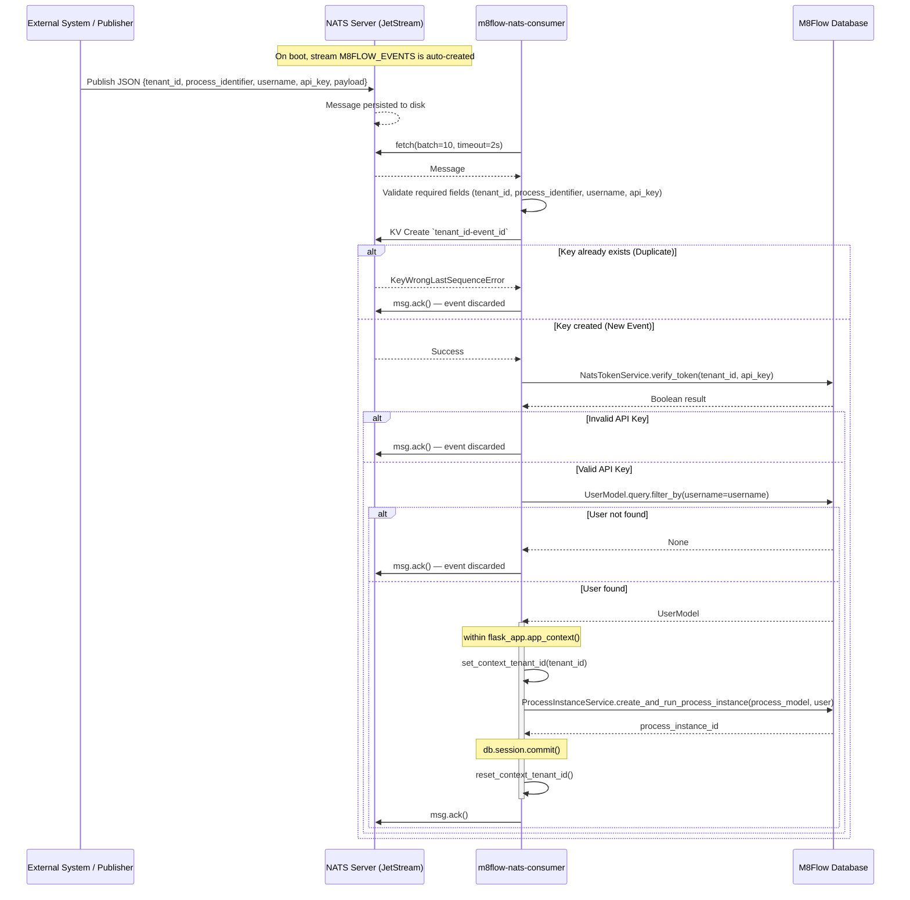

# M8Flow Event-Driven Architecture

M8Flow supports automatic triggering by external business events (e.g., "Order Placed", "Invoice Paid") through a standalone **NATS Consumer Service** (`m8flow-nats-consumer`).

---

## 1. System Architecture

---

## 2. Event Message Schema

Every NATS event must carry the following JSON fields:

| Field                | Required | Description                                        |
| -------------------- | -------- | -------------------------------------------------- |
| `tenant_id`          | ✅       | M8Flow tenant UUID — used for DB context switching |
| `process_identifier` | ✅       | BPMN process path, e.g. `billing/invoice-paid`     |
| `username`           | ✅       | M8Flow username who owns the process instance      |
| `api_key`            | ✅       | M8Flow API Key (from `/nats-tokens` API)           |
| `payload`            | No       | Arbitrary JSON injected as process variables       |
| `id`                 | No       | Event UUID — used for NATS KV idempotency/dedup    |

> **Separation of concerns:** `api_key` authenticates the publisher system (proving they are allowed to send events for the tenant). `username` controls which M8Flow user the workflow runs as.

---

## 3. Core Concepts

- **API Key Security:** The consumer reads the `api_key` from the event payload and verifies it securely. The provided key is hashed using HMAC-SHA256 with a salt, and compared via `NatsTokenService` against the hashed token stored in the tenant's `m8flow_nats_tokens` database table. Invalid keys result in the event being discarded.
- **Required Username:** The `username` field is required and must match an existing M8Flow `UserModel`. The `api_key` authenticates the _publisher_; the username controls _process ownership_.
- **Native Database Integration:** After authentication, `ProcessInstanceService` is invoked directly inside a Flask application context — no HTTP API hop.
- **Durable Pull Consumer:** JetStream pull subscriptions provide backpressure — a high influx of events cannot overwhelm the backend.
- **Tenant-Scoped Idempotency:** Uses NATS Key-Value (KV) store for exact-once processing. Events with the same `id` and `tenant_id` within the `M8FLOW_NATS_DEDUP_TTL` window (default 24h) are atomically discarded.
- **Multi-Tenant Context Switching:** `set_context_tenant_id(tenant_id)` switches the active DB schema before running the process, ensuring tenant isolation.

---

## 4. Security & Execution Model

1. **Required fields validated** — `tenant_id`, `process_identifier`, `username`, and `api_key` must all be present or the event is discarded.
2. **Idempotency check** — `consumer.py` attempts to atomically create a NATS KV entry `tenant_id-event_id`. If `KeyWrongLastSequenceError` is raised, it's a duplicate and is discarded.
3. **API Key verification** — `NatsTokenService` computes the HMAC sum of the `api_key` and queries the database to compare against the hash stored in `NatsTokenModel` for that `tenant_id`.
5. **User lookup** — `UserModel` queried by `username` from the payload. If not found, event is discarded.
6. **Context activation** — Flask app context + `set_context_tenant_id(tenant_id)`.
7. **Process instantiation** — `ProcessInstanceService.create_and_run_process_instance` called directly.
8. **Clean teardown** — DB committed, tenant context reset; `msg.ack()` sent. (If DB error occurs, the KV dedup key is deleted and `msg.nak()` is dispatched for retry).

---

## 5. Execution Flow Diagram

## 6. Environment Variables

The `consumer.py` uses the following NATS configurations. **All of these must be defined in your `.env` file** (there are no fallbacks; the service will fail-fast if they are missing):

| Variable                    | Example Value            | Description                                                      |
| :-------------------------- | :----------------------- | :--------------------------------------------------------------- |
| `M8FLOW_NATS_URL`           | `nats://localhost:4222`  | Connection string for NATS JetStream server.                     |
| `M8FLOW_NATS_STREAM_NAME`   | `M8FLOW_EVENTS`          | The JetStream stream to create/listen to.                        |
| `M8FLOW_NATS_SUBJECT`       | `m8flow.events.>`        | The NATS subject mask to subscribe to.                           |
| `M8FLOW_NATS_DURABLE_NAME`  | `m8flow-engine-consumer` | Durable pull consumer name.                                      |
| `M8FLOW_NATS_FETCH_BATCH`   | `10`                     | Max messages to pull in one polling cycle.                       |
| `M8FLOW_NATS_FETCH_TIMEOUT` | `2.0`                    | Polling wait time in seconds.                                    |
| `M8FLOW_NATS_DEDUP_BUCKET`  | `m8flow-dedup`           | Name of the NATS KV Bucket used for deduplication.               |
| `M8FLOW_NATS_DEDUP_TTL`     | `86400`                  | Time in seconds to remember an event block duplicate processing. |
