# How to Use m8flow

This guide walks through the first admin workflows after signing in.

Use this tutorial to learn the basic m8flow workflow setup: organize work with a process group, create a process model, and build your first workflow.

## Menu

- [Creating a process group](#creating-a-process-group)
- [Creating a process model](#creating-a-process-model)
- [Create the first workflow](#create-the-first-workflow)
- [How to Use the User Task](#how-to-use-the-user-task)
- [How to assign a task to User by Group](#how-to-assign-a-task-to-user-by-group)
- [Next Steps](#next-steps)

## Before You Start

- Start m8flow and open [http://localhost:6853/](http://localhost:6853/).
- Sign in to the default `m8flow` tenant as `admin`.
- If this is your first login for the `admin` user, update the temporary password when prompted.

## Creating a Process Group

1. After signing in as `admin`, the admin home page opens.

   <div align="center">
      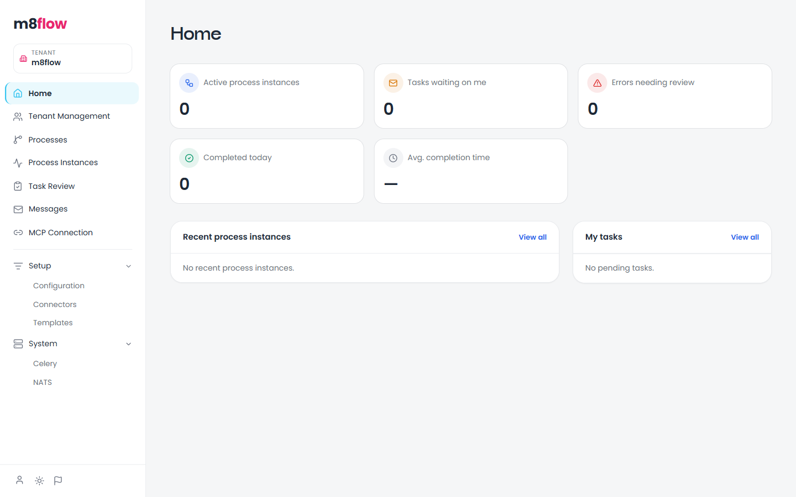
   </div>

2. Open **Processes** from the left sidebar.

   <div align="center">
      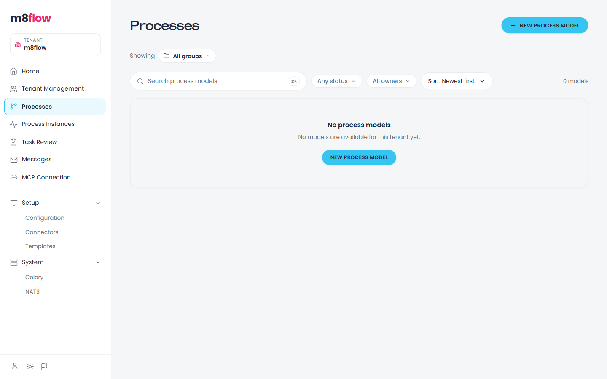
   </div>

3. Select the group filter next to **Showing** (it reads **All groups**) to open the
   **Process groups** dialog, then select **New group**.

   <div align="center">
      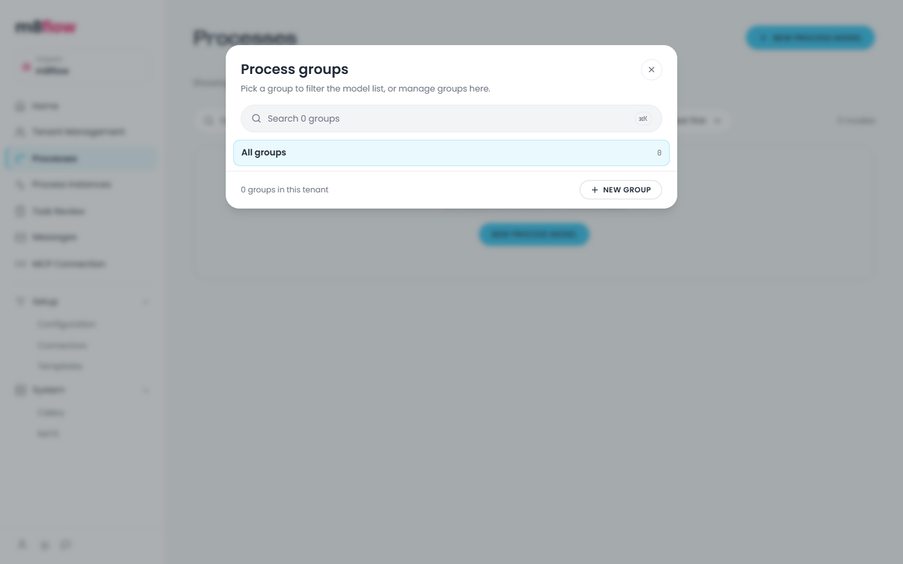
   </div>

4. Enter the process group details.

   | Field | Description | Example |
   |-------|-------------|---------|
   | **Id** | Folder path for the group, and its unique identifier. Nest with `parent/child`. | `group-a` |
   | **Display name** | Human-readable name shown in the UI. | `Group A` |
   | **Description** | Short explanation of what the group contains. Optional. | `A test group` |

   <div align="center">
      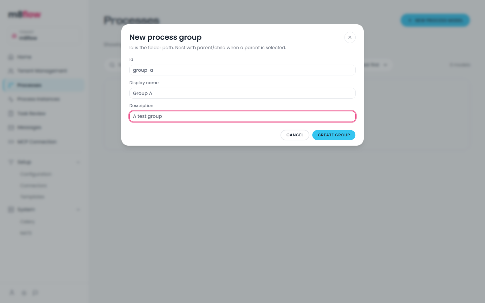
   </div>

5. Select **Create group** to save the process group.

6. The new group appears in the **Process groups** dialog, with a count of the models it
   contains.

   <div align="center">
      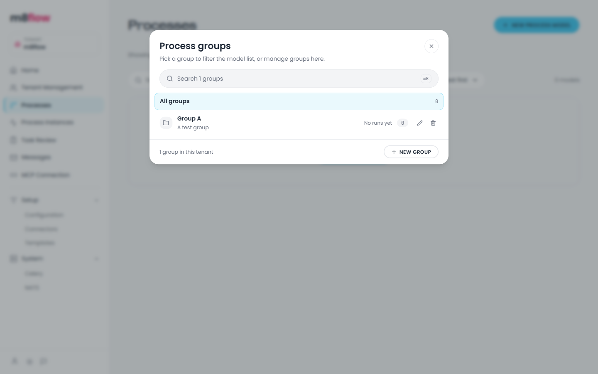
   </div>

7. Select the group to filter the **Processes** list to that group. The filter chip and
   the `?group=` URL both show which group is active, and any model you create from here
   defaults to it.

   <div align="center">
      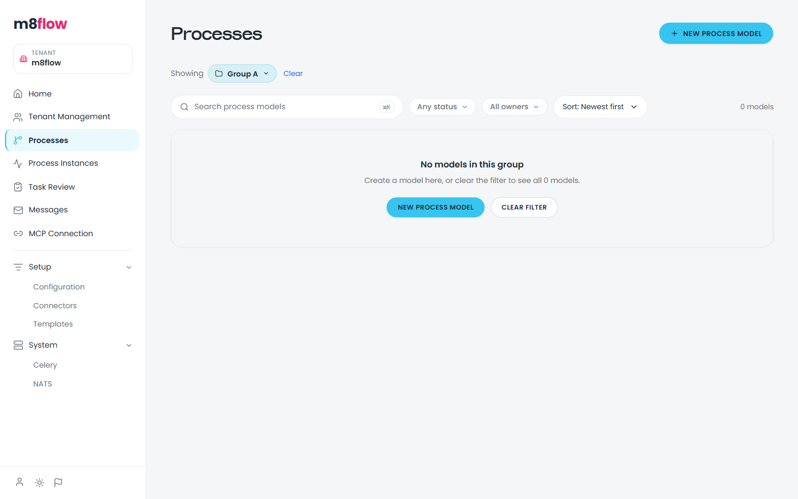
   </div>

## Creating a Process Model

After creating a process group, create process models inside it.

1. On the **Processes** page, select **New process model**.

   <div align="center">
      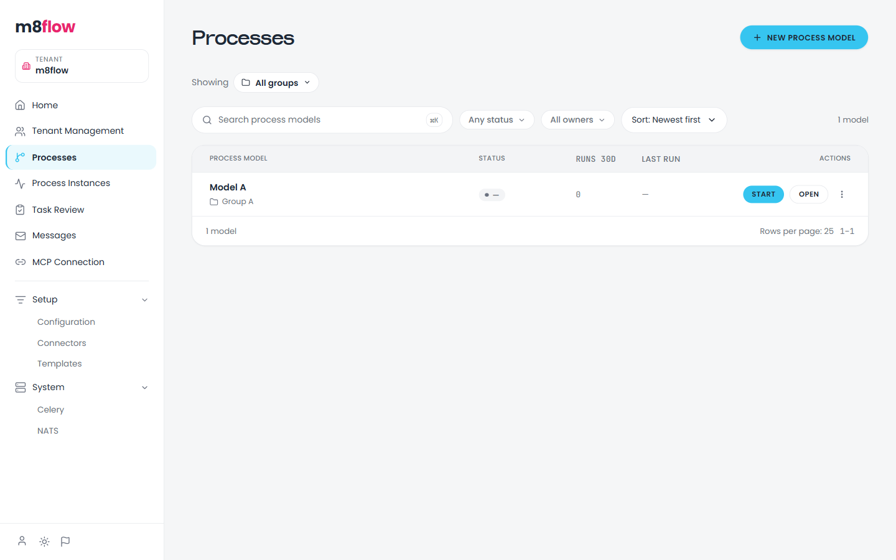
   </div>

2. Enter the process model details.

   | Field | Description | Example |
   |-------|-------------|---------|
   | **Process group** | The group the model belongs to. Defaults to the group you filtered by. | `Group A` |
   | **Display name** | Human-readable name shown in the UI. | `Model A` |
   | **Identifier** | Unique URL-friendly identifier. m8flow generates this from the display name, and you can edit it before creating. | `model-a` |
   | **Description** | Short explanation of what the process model contains. Optional. | `A test model` |

   <div align="center">
      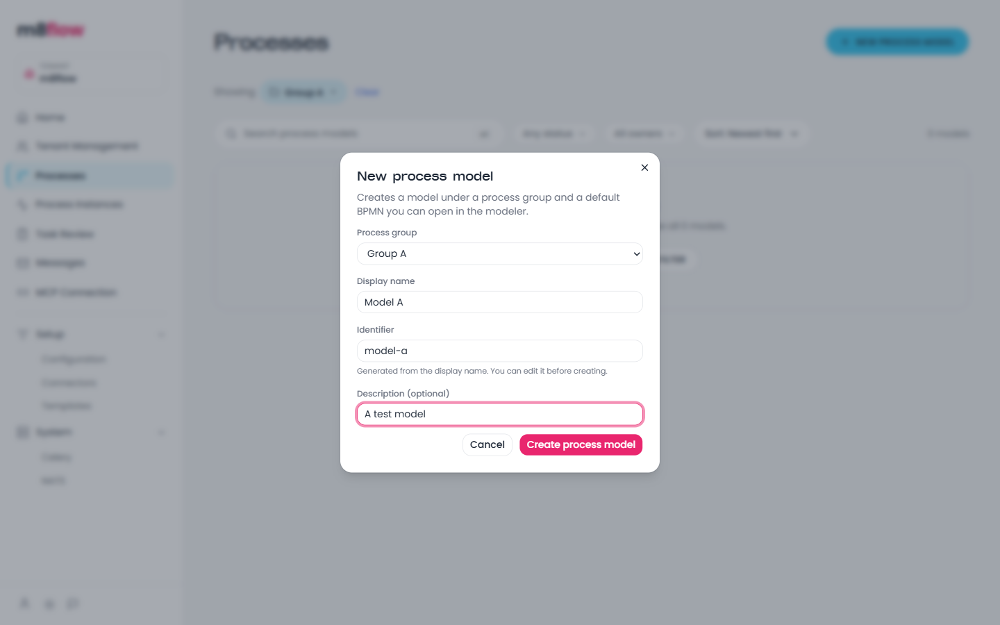
   </div>

3. Select **Create process model** to save it. m8flow creates a default BPMN file
   alongside the model and opens the model's detail page.

4. The model also appears in the **Processes** list.

   <div align="center">
      
   </div>

5. The model detail page shows its run statistics, its **Files** (the BPMN plus any form
   schemas), and its **Tests**, and is where you select **Start process** or
   **Open in modeler**.

   <div align="center">
      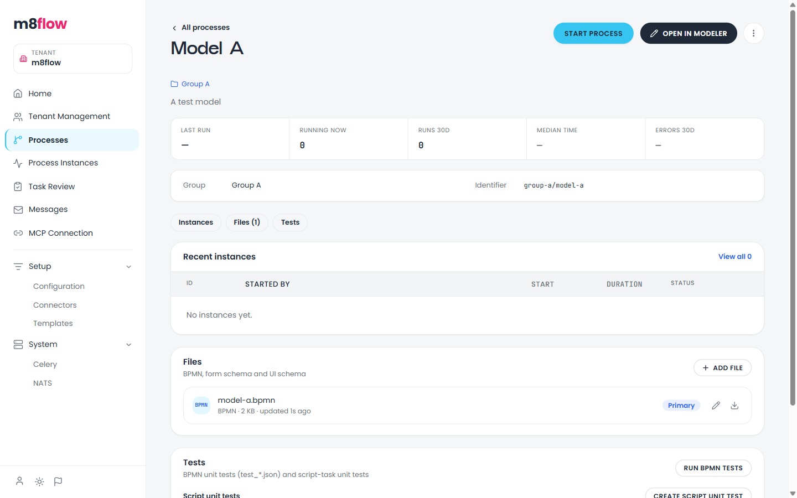
   </div>

## Create the First Workflow

After creating a process model, use the modeler to run your first workflow.

1. Open the process model. A default workflow is created automatically when the process model is created.

   <div align="center">
      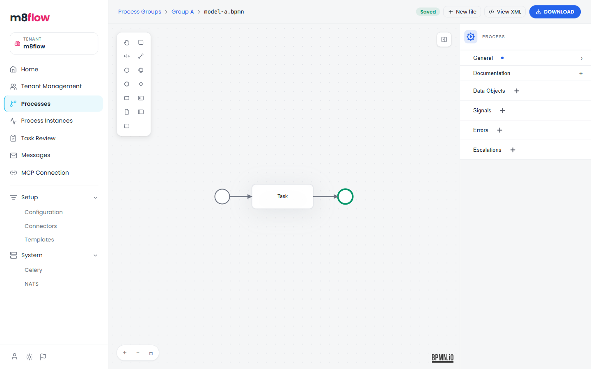
   </div>

2. Go back to the model detail page and select **Start process**.

   <div align="center">
      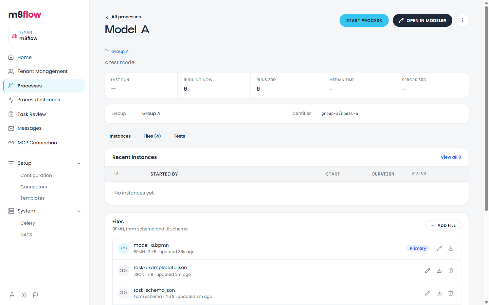
   </div>

3. m8flow creates an instance and opens it. A workflow with no user input runs straight
   through; one with a user task stops with the status **User input required** and lists
   the waiting task under **Tasks I can complete**.

4. Open **Process Instances** from the left sidebar to verify the workflow ran successfully. The instance appears with a **Complete** status.

   <div align="center">
      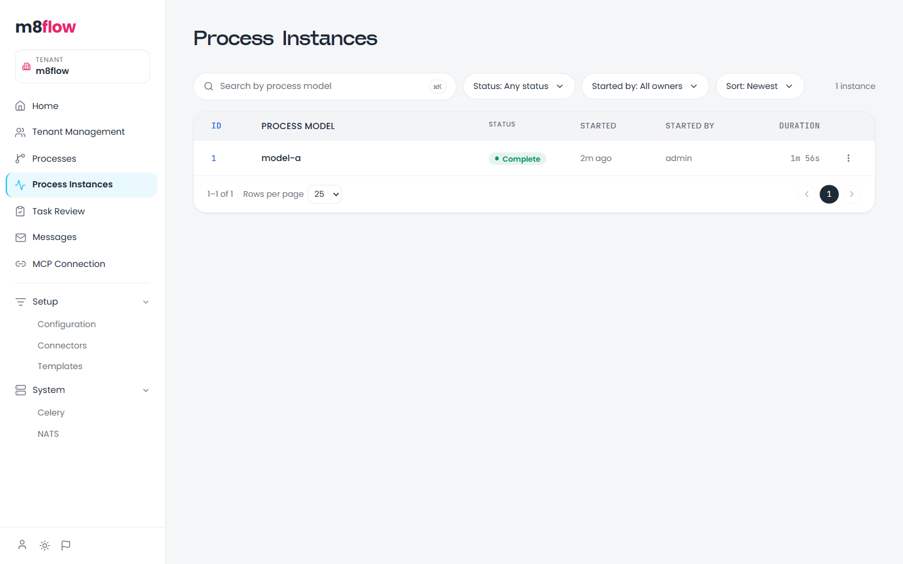
   </div>

## How to Use the User Task

After opening a process model, you can convert a task element to a user task and attach a form to it.

1. In the workflow, select the settings icon on a task element and choose **User Task** from the list. Alternatively, drag a new task box onto the canvas, select its settings icon, and choose **User Task**.

   <div align="center">
      
   </div>

2. Select the user task element to open its properties panel on the right side.

   <div align="center">
      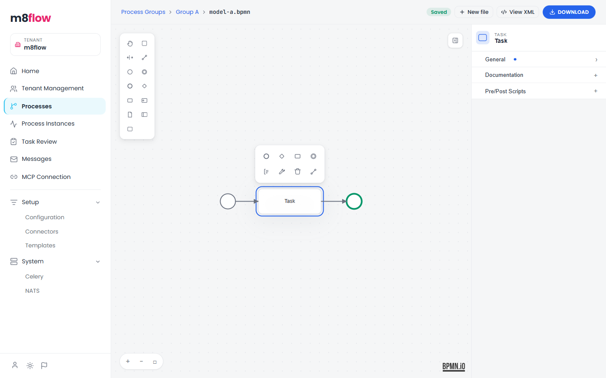
   </div>

   The properties panel contains the following tabs.

   | Section | Description |
   |-----|-------------|
   | **General** | Set the name and ID for the user task. |
   | **Documentation** | Add documentation for the user task. |
   | **Pre/Post Scripts** | Add scripts to run before or after the task. |
   | **Web Form (with Json Schemas)** | Attach a JSON-schema form to the user task. |
   | **Web Form (External Form)** | Point the task at an externally hosted form instead. |
   | **Instructions** | Add Markdown instructions displayed above the form on the task page. |
   | **Guest options** | Configure guest access options for the user task. |
   | **Task Metadata** | Add metadata shown alongside the task. |
   | **Input/Output Management** | Manage input and output variables for the user task. |

3. Expand **Web Form (with Json Schemas)** and select **Launch Editor** to open the form editor.

   <div align="center">
      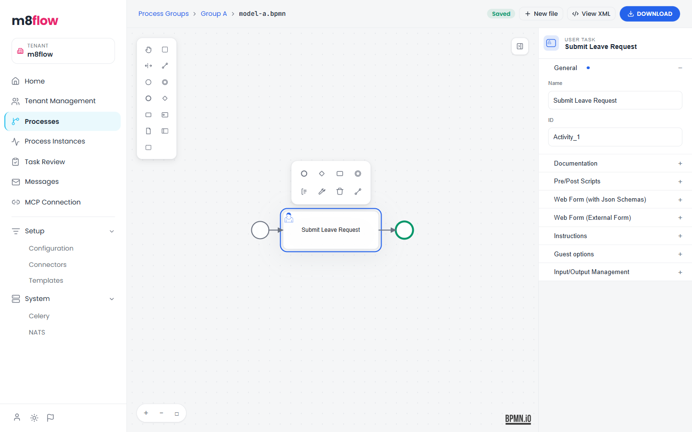
   </div>

   <div align="center">
      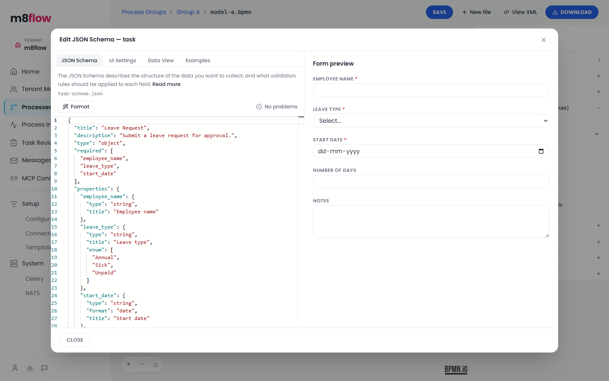
   </div>

4. The editor opens on the **JSON Schema** tab with an empty `{}` document, and names its
   files after the task id — for a task with id `task`, that is `task-schema.json`,
   `task-uischema.json` and `task-exampledata.json`. The **UI Settings**, **Data View**
   and **Examples** tabs edit the other two files.

5. Edit each tab's content. **Form preview** on the right re-renders as you type, so you
   can check the form without leaving the editor.

   **`sample-form-schema.json`**

   ```json
   {
     "$schema": "http://json-schema.org/draft-07/schema#",
     "title": "Sample Form",
     "type": "object",
     "properties": {
       "name": {
         "type": "string",
         "title": "Name"
       },
       "email": {
         "type": "string",
         "title": "Email"
       },
       "age": {
         "type": "number",
         "title": "Age"
       },
       "gender": {
         "type": "string",
         "title": "Gender"
       },
       "address": {
         "type": "string",
         "title": "Address"
       }
     },
     "required": [
       "name",
       "email",
       "age",
       "gender",
       "address"
     ]
   }
   ```

   <div align="center">
      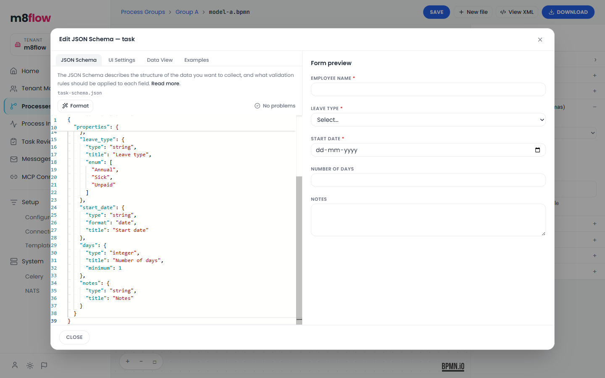
   </div>

   **`sample-form-uischema.json`**

   ```json
   {
     "type": "VerticalLayout",
     "elements": [
       {
         "type": "Control",
         "scope": "#/properties/name"
       },
       {
         "type": "Control",
         "scope": "#/properties/email"
       },
       {
         "type": "Control",
         "scope": "#/properties/age"
       },
       {
         "type": "Control",
         "scope": "#/properties/gender"
       },
       {
         "type": "Control",
         "scope": "#/properties/address"
       }
     ]
   }
   ```

   <div align="center">
      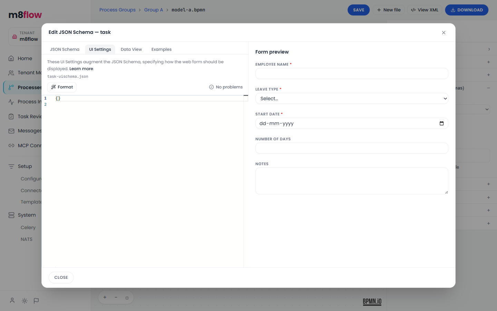
   </div>

6. Select **CLOSE** to return to the properties panel, then select **SAVE** in the
   modeler header so the new files are written to the model.

   <div align="center">
      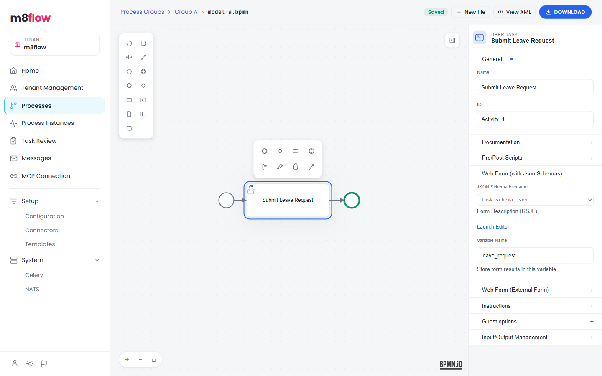
   </div>

7. Reopen the model in the modeler and select the user task again. In
   **Web Form (with Json Schemas)**, pick the schema from **JSON Schema Filename** (it is
   only listed once the file has been saved) and set **Variable Name** to the variable the
   submitted form should be stored in, for example `leave_request`. Select **SAVE** again.

   <div align="center">
      
   </div>

8. Go to the model detail page and select **Start process** to run it.

   <div align="center">
      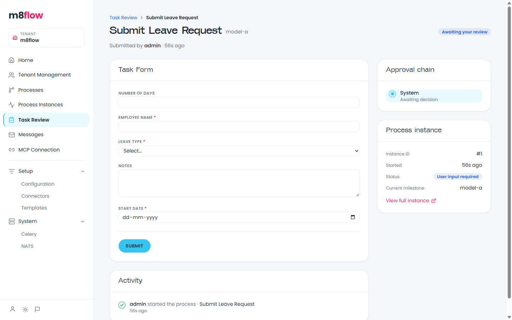
   </div>

   The task page displays the default instructions above the form.

9. Fill in the form and select **SUBMIT** to complete the task.

   <div align="center">
      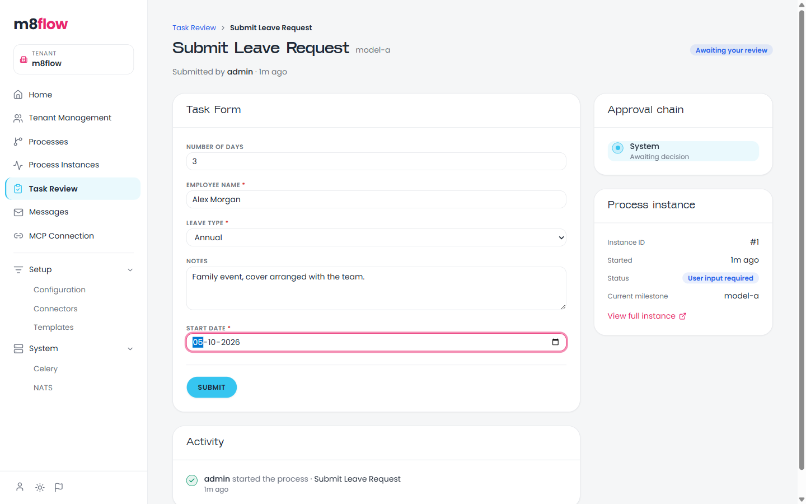
   </div>

10. Open **Process Instances** from the left sidebar to verify the workflow status.

11. The instance page shows the live diagram, the task that is waiting, and the
    **Approval chain**, **Process instance** and **Activity** panels.

    <div align="center">
       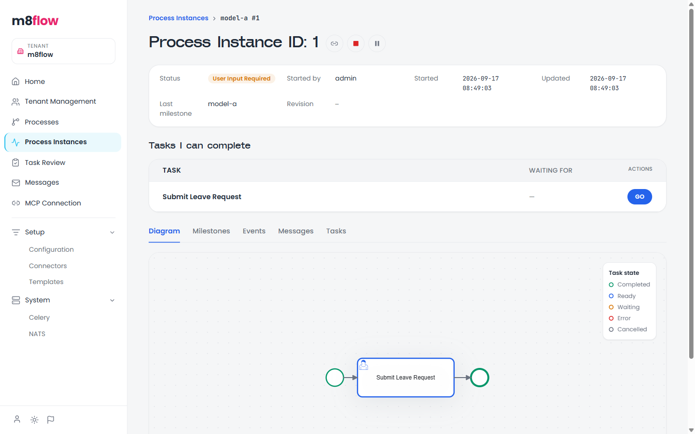
    </div>

## How to Assign a Task to a User by Group

After creating a process model, you can assign a user task to a specific group using swimlane pools.

1. Create a new process model and open it in the modeler.

2. Drag a **Pool** from the left panel onto the canvas. Convert the default task element in the pool to a **User Task** using the settings icon.

3. Split the pool into two lanes. Place the start event in the first lane (no name required) and the user task and end event in the second lane.

   To split the lane, select the lane and use the lane actions available on the right side of the pool.

   <div align="center">
      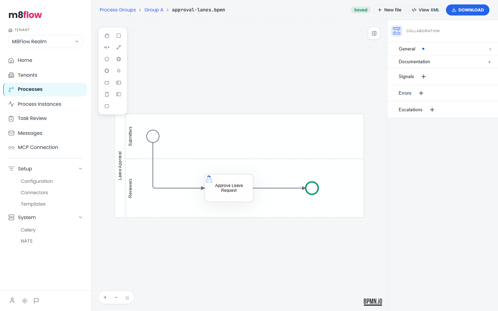
   </div>

4. Set the second lane name to match an existing group in Keycloak (for example, `HR`, `Reviewers`, or `Finance`).

   > **Note:** The group must exist in Keycloak, and the assigned user must belong to that group and have the correct role to access the task.

   <div align="center">
      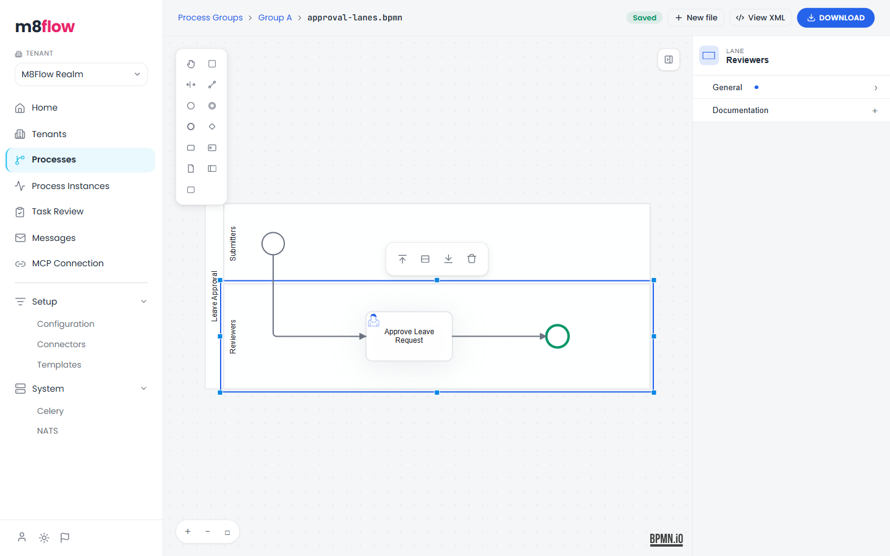
   </div>

5. Save the workflow, then select **Start process** on the model detail page to run it.

6. Sign in as a user who belongs to the assigned group and verify that the task appears on their home page.

7. Complete the task and open **Process Instances** from the left sidebar to confirm the task status is updated.

## Next Steps

To go further, explore the following resources.

| Resource | Description |
|----------|-------------|
| [Sample Templates](../m8flow-backend/sample_templates/README.md) | Pre-built workflow templates (approval flows, escalation workflows, form-driven processes) that can be loaded into the database on startup. |
| [Connectors](../m8flow-connector-proxy/README.md) | Available service task connectors for integrating with external systems such as HTTP, SMTP, PostgreSQL, Slack, Salesforce, and Stripe. |
