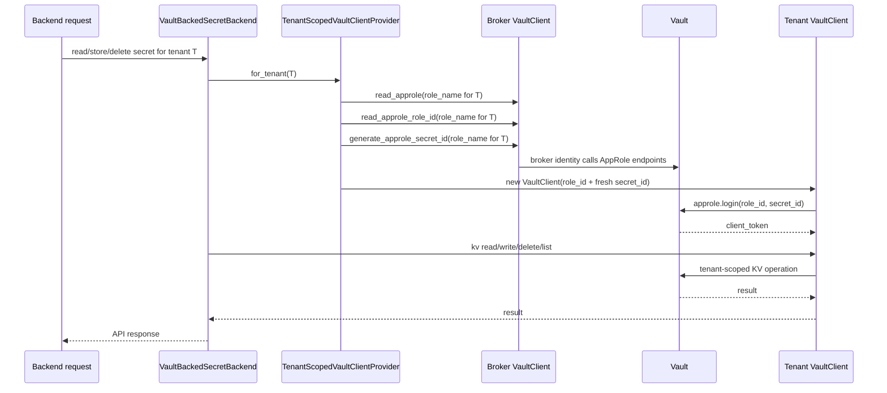

# Vault Local Development

This repository supports two local Vault workflows:

- `vault` profile: a manual single-node development Vault.
- `vault-demo` profile: a development-only bootstrap layer on top of `vault` that initializes, unseals, configures, seeds, and verifies Vault automatically.

Both workflows are local-only. They use a single-node HTTP Vault with no TLS, no HA, no audit device, and no production-grade unseal strategy.

The local dev setup now has two distinct Vault identity layers:

- a shared broker/control-plane AppRole created by `vault-demo` so backend and Celery containers can start in Vault mode and mint tenant-scoped Vault clients in local Docker;
- per-tenant Vault policies and AppRoles created by M8Flow itself when tenants are provisioned, so Vault becomes the tenant-isolation backstop.

## Architecture

- Base Vault service: `vault`
- Demo bootstrap service: `vault-demo`
- Vault image: `hashicorp/vault:1.18.5`
- Vault server config: [docker/vault/config/vault.hcl](../docker/vault/config/vault.hcl)
- Policy template: [docker/vault/policies/m8flow-policy.hcl.tpl](../docker/vault/policies/m8flow-policy.hcl.tpl)
- Tenant AppRole helper scripts:
  [docker/vault/scripts/print-tenant-vault-approle.sh](../docker/vault/scripts/print-tenant-vault-approle.sh)
  and
  [docker/vault/scripts/print-tenant-vault-approle.ps1](../docker/vault/scripts/print-tenant-vault-approle.ps1)
- Demo bootstrap script: [docker/vault/demo/bootstrap_vault_demo.py](../docker/vault/demo/bootstrap_vault_demo.py)
- Demo seed template: [docker/vault/demo/secrets.yml.sample](../docker/vault/demo/secrets.yml.sample)
- Runtime verification script: [docker/vault/demo/verify_backend_vault_demo.py](../docker/vault/demo/verify_backend_vault_demo.py)
- Persistent Vault data volume: `m8flow_vault-data`
- Persistent demo state volume: `m8flow_vault-demo-state`
- Host UI/API URL: `http://127.0.0.1:${M8FLOW_VAULT_PORT:-8200}`
- In-container Vault URL: `http://vault:8200`
- KV v2 mount used by M8Flow: `kv`
- Logical secret path convention: `kv/m8flow/tenants/{tenant_id}/secrets/{secret_name}`

The `vault-demo` profile stores generated local-only files inside the named demo state volume at `/vault/demo`:

- `init.json` (encrypted at rest)
- `m8flow-role-id` (encrypted at rest)
- `m8flow-secret-id` (encrypted at rest)
- `runtime.env`
- `verification.json`

Because those files live in a Docker volume instead of the repository, they are not committed and do not need `.gitignore` entries.

## Current vs Production Posture

This document describes the current M8Flow Vault implementation and the local `vault-demo` workflow. It is not a production hardening guide.

What is true today:

- M8Flow uses a broker/control-plane Vault identity to manage per-tenant AppRoles and to mint tenant-scoped clients.
- Tenant secret CRUD happens through tenant-scoped Vault tokens derived from those tenant AppRoles.
- The local `vault-demo` workflow stores development bootstrap state in a Docker volume and encrypts those local files at rest.
- The backend exposes a dedicated Vault health endpoint at `/v1.0/vault-status` and writes Vault-related application audit events to `m8flow_audit_log`.

What is intentionally local-development-only:

- single-node HTTP Vault;
- no TLS;
- no HA;
- no production-grade unseal strategy;
- persisted development bootstrap state in Docker volumes;
- helper scripts that can reveal a tenant AppRole `secret_id` when you opt in explicitly.

What is still not production-hardened in the current code:

- M8Flow does not yet enforce AppRole TTL or one-time-use settings such as `secret_id_ttl`, `secret_id_num_uses`, `token_ttl`, or `token_max_ttl`;
- the broker identity is still a high-privilege control-plane credential and must be treated as such;
- this document does not define a production auth method, TLS setup, audit-device configuration, or secret rotation policy.

## Per-Tenant Vault Identities

When `M8FLOW_VAULT_ENABLED=true`, M8Flow now provisions Vault-side tenant identities automatically:

- the create-tenant API creates a tenant-scoped ACL policy and AppRole after the Keycloak organization and local tenant row are created;
- the shared-realm bootstrap provisions the default `m8flow` tenant's Vault identity after reconciling the canonical tenant UUID;
- the generated tenant policy is limited to that tenant's secret subtree, following the logical path convention `kv/m8flow/tenants/{tenant_id}/secrets/{secret_name}`;
- tenant AppRoles default to `secret_id_num_uses=1`, `secret_id_ttl=10m`, `token_ttl=10m`, and `token_max_ttl=30m` unless you override the `M8FLOW_VAULT_TENANT_*` settings;
- repeated startup/bootstrap passes reconcile the role and policy without rotating the existing tenant AppRole `secret_id`.

The configured runtime token or AppRole is now a broker/control-plane identity. M8Flow uses it to create, reconcile, and resolve tenant-specific AppRoles, then performs tenant secret CRUD through tenant-scoped Vault clients derived from those AppRoles. If that broker identity can still read tenant KV data directly, the local setup is misconfigured.

## Tenant Lifecycle

When Vault mode is enabled, tenant provisioning now has an explicit Vault lifecycle.

### New Tenant Creation

On the tenant-create API path, M8Flow currently does this in order:

1. Create the Keycloak organization.
2. Create the local `m8flow_tenant` row.
3. Provision the tenant's Vault policy and AppRole.

The tenant Vault identity is built from the canonical tenant UUID, not from the display name. The current naming logic uses the configured prefixes plus Vault-safe normalization:

- policy name: `{M8FLOW_VAULT_TENANT_POLICY_PREFIX}-{tenant_id}`
- AppRole name: `{M8FLOW_VAULT_TENANT_ROLE_PREFIX}-{tenant_id}`

The generated tenant policy is limited to the tenant's own subtree:

- secret value path pattern: `kv/m8flow/tenants/{tenant_id}/secrets/{secret_name}`
- KV metadata list path pattern: `kv/metadata/m8flow/tenants/{tenant_id}/secrets/...`

On first provisioning, M8Flow:

- creates or updates the tenant ACL policy;
- creates or updates the tenant AppRole;
- reads the AppRole `role_id`;
- generates an initial AppRole `secret_id`;
- returns that initial identity material to the provisioning flow without creating a placeholder KV secret.

On later reconciliation passes, M8Flow still reconciles the policy and AppRole, but it does not rotate the original tenant AppRole `secret_id` just because startup ran again.

There is no longer a bootstrap-marker secret for tenant initialization. In KV v2, the tenant `secrets/` path becomes visible in the Vault UI only after the first real secret is written.

### Failure Behavior During Tenant Creation

If Vault provisioning fails during the tenant-create API flow, M8Flow returns `502` and attempts to roll the tenant creation back:

- the local tenant row is deleted;
- the Keycloak organization is deleted;
- the response explains that Vault provisioning could not be completed.

If cleanup itself fails, the response warns that manual cleanup may still be required.

### Shared-Realm Default Tenant

The same provisioning logic is also used for the canonical shared-realm `m8flow` tenant during shared-realm bootstrap. That is why a clean local rebuild can create the `m8flow` tenant path even before you create any additional tenant manually.

## Resolve One Tenant-Scoped AppRole

Use these helpers when you want to sign in to the local Vault UI with one tenant's AppRole only.

Both scripts:

- accept a tenant `id`, `slug`, or `name`;
- resolve the canonical tenant UUID from `m8flow_tenant`;
- compute the tenant AppRole name using the repo's own provisioning logic;
- mint a fresh tenant AppRole `secret_id`;
- print the `role_id`, a masked `secret_id` by default, the AppRole auth URL, and the tenant secrets URL.
- only print the real `secret_id` when you pass an explicit reveal flag.

PowerShell:

```powershell
powershell -ExecutionPolicy Bypass -File docker/vault/scripts/print-tenant-vault-approle.ps1 -Tenant Test
```

POSIX shell:

```bash
sh docker/vault/scripts/print-tenant-vault-approle.sh Test
```

If you need the actual `secret_id` for a one-time local AppRole sign-in, opt in explicitly:

```powershell
powershell -ExecutionPolicy Bypass -File docker/vault/scripts/print-tenant-vault-approle.ps1 -Tenant Test -ShowSecretId
```

```bash
sh docker/vault/scripts/print-tenant-vault-approle.sh --show-secret-id Test
```

Use the printed `role_id` and, when explicitly revealed, the `secret_id` to sign in at the printed `approle_auth_url`.

Notes:

- Each run mints a new tenant AppRole `secret_id`. Treat it like a credential.
- The generated `secret_id` is single-use by default and expires after `10m` unless you override the tenant AppRole lifetime settings.
- The real `secret_id` is hidden by default so it does not land in routine shell output or copied logs by accident.
- When you reveal it with `-ShowSecretId` or `--show-secret-id`, the scripts print a warning to `stderr` before writing the secret to `stdout`.
- If `M8FLOW_VAULT_OPERATOR_TOKEN` or `VAULT_TOKEN` is set in your host shell, the helpers use that operator token.
- Otherwise, in the local `vault-demo` workflow they fall back to the encrypted persisted `root_token` from `/vault/demo/init.json` by using the repo-owned bootstrap decryption helper.
- These helpers are local-development tooling. They are not intended for production Vault access flows.

## Start Only The Base Vault Service

Use this when you want a manual Vault and do not want auto-seeding:

```bash
docker compose --profile vault -f docker/m8flow-docker-compose.yml up -d vault
docker compose -f docker/m8flow-docker-compose.yml exec vault vault status
```

Expected first-run status:

- `Initialized false`
- `Sealed true`
- UI/API still reachable

If you stay on the manual path, initialize and unseal Vault yourself:

```bash
docker compose -f docker/m8flow-docker-compose.yml exec vault vault operator init
docker compose -f docker/m8flow-docker-compose.yml exec vault vault operator unseal
```

Then use one of the repo-owned policy bootstrap helpers:

```bash
export M8FLOW_VAULT_OPERATOR_TOKEN=<authorized-operator-token>
bash docker/vault/scripts/configure-m8flow-vault.sh
```

```powershell
$env:M8FLOW_VAULT_OPERATOR_TOKEN = "<authorized-operator-token>"
powershell -ExecutionPolicy Bypass -File docker/vault/scripts/configure-m8flow-vault.ps1
```

Those helpers keep the base `vault` profile manual. They enable the KV v2 mount and write the policy, but they do not auto-seed demo data.

## Start The Demo Bootstrap Workflow

Use this when you want an end-to-end local Vault demo with broker AppRole credentials and seeded secrets:

```bash
docker compose -f docker/m8flow-docker-compose.yml --profile vault --profile vault-demo up -d --build
```

If you want real demo secrets seeded, create your local seed file first:

```bash
cp docker/vault/demo/secrets.yml.sample docker/vault/demo/secrets.yml
```

```powershell
Copy-Item docker/vault/demo/secrets.yml.sample docker/vault/demo/secrets.yml
```

Then edit `docker/vault/demo/secrets.yml` and define the secrets you want seeded for the shared-realm `m8flow` tenant:

```yaml
tenants:
  m8flow:
    secrets:
      API_TOKEN: your-local-demo-token
      SMTP_PASSWORD: your-local-demo-password
```

What the `vault-demo` profile does on each run:

- waits for the base `vault` service;
- initializes Vault if needed and persists the encrypted init payload in the demo state volume;
- auto-unseals Vault using the persisted development unseal key;
- enables KV v2 at `kv` if it is missing;
- enables AppRole auth if it is missing;
- creates or updates the shared broker `m8flow` policy;
- creates or updates the shared broker `m8flow` AppRole;
- reuses the persisted broker AppRole `secret_id` when it is still valid, otherwise generates a new one;
- writes `runtime.env` plus encrypted file-backed broker AppRole credentials into `/vault/demo`;
- if `docker/vault/demo/secrets.yml` exists, seeds it under the canonical tenant UUID that corresponds to the shared-realm `m8flow` organization alias;
- if `docker/vault/demo/secrets.yml` is absent, skips tenant secret seeding entirely while still bootstrapping Vault and the canonical `m8flow` tenant identity;
- skips existing seeded secrets by default;
- overwrites seeded secrets only when `M8FLOW_VAULT_DEMO_OVERWRITE=true`;
- provisions the seeded tenant's Vault policy and AppRole through the broker identity;
- verifies the broker identity cannot read the tenant secret directly;
- verifies the repo's backend `VaultClient` can read the seeded secret only after switching into a tenant-scoped Vault client.

When no real secret has been seeded yet, the tenant `secrets/` path will not appear in the Vault UI. That is normal for KV v2: empty folders are not persisted separately from secret documents.

That `m8flow` AppRole is the shared local broker identity. It is separate from the per-tenant AppRoles that M8Flow provisions when tenant creation/bootstrap runs.

The backend, Celery worker, Celery Flower, and the optional NATS workers mount `/vault/demo` read-only. Their startup commands load `runtime.env` automatically when it exists so the demo profile can supply the Vault address plus file-backed AppRole credentials. `M8FLOW_VAULT_ENABLED` is still controlled by your local `.env`.

## Runtime Auth Flow

The backend does not read tenant secrets with the shared broker identity directly.

Instead, the current implementation does this:

1. The backend starts with a broker/control-plane Vault identity from env such as `M8FLOW_VAULT_TOKEN` or `M8FLOW_VAULT_ROLE_ID` plus `M8FLOW_VAULT_SECRET_ID`.
2. A secret CRUD or list request reaches `VaultBackedSecretBackend`.
3. The backend resolves the current tenant id and asks `TenantScopedVaultClientProvider` for a tenant-scoped Vault client.
4. The provider uses the broker Vault client to read the tenant AppRole, read its `role_id`, and mint a fresh tenant `secret_id`.
5. The provider builds a new tenant `VaultClient` with that `role_id` and `secret_id`.
6. That tenant `VaultClient` logs in to Vault through AppRole and receives a Vault client token.
7. The tenant-scoped token performs the actual KV read, write, delete, or list operation under `kv/m8flow/tenants/{tenant_id}/secrets/...`.

Here is the current flow, based on the code paths in `secret_backend.py`, `tenant_scoped_vault_client_provider.py`, `tenant_vault_provisioning_service.py`, and `vault_client.py`:



Notes:

- The broker identity is a control-plane identity. It is used to manage tenant AppRoles and mint tenant-scoped access, not to read tenant secret values directly.
- The data-plane secret operation happens with the tenant Vault token returned by the AppRole login.
- The current code already mints a fresh tenant `secret_id` when it builds a tenant-scoped client.
- The current code does not yet enforce explicit AppRole TTL or one-time-use settings in M8Flow itself. If you need a hardened production posture, configure or implement `secret_id_ttl`, `secret_id_num_uses`, `token_ttl`, and `token_max_ttl`.

### Broker Authentication At Startup

At backend startup, `configure_vault()` reads `VaultSettings.from_env()` and then:

- leaves the app on the legacy secret backend when `M8FLOW_VAULT_ENABLED=false`;
- fails startup immediately when Vault mode is enabled but `M8FLOW_VAULT_ADDR` or the broker credentials are incomplete;
- validates that Vault is initialized, unsealed, authenticated, and pointed at a KV v2 mount before the app starts serving Vault-backed secret requests.

The broker/control-plane identity can be supplied in one of two ways:

- token auth: `M8FLOW_VAULT_TOKEN` or `VAULT_TOKEN`, optionally through the matching `*_FILE` variant;
- AppRole auth: `M8FLOW_VAULT_ROLE_ID` plus `M8FLOW_VAULT_SECRET_ID`, optionally through the matching `*_FILE` variants.

If the broker identity itself is configured as an AppRole, Vault issues a broker client token during that AppRole login. If the broker identity is configured as a token, M8Flow uses that token directly.

### Is The Secret Read Using A Short-Lived Token?

Yes, the actual tenant secret read/write/delete/list operation is performed with a Vault client token returned by the tenant AppRole login, not with the broker identity directly.

What is dynamic today:

- M8Flow mints a fresh tenant AppRole `secret_id` when it builds a tenant-scoped client.
- M8Flow logs in with that tenant AppRole and receives a client token for the data-plane operation.

What is not yet enforced by M8Flow itself:

- explicit `secret_id_ttl`;
- explicit `secret_id_num_uses`;
- explicit `token_ttl`;
- explicit `token_max_ttl`.

So the operation uses a Vault-issued token, but whether it is truly short-lived or one-time-use depends on the Vault-side AppRole role configuration you apply.

## Vault-Down Behavior

M8Flow now treats Vault availability as a first-class runtime condition instead of a generic secret error.

### Dedicated Status Endpoint

The backend exposes a separate Vault health endpoint:

- `GET /v1.0/vault-status`

Current behavior:

- returns `200` with `ok: true` when Vault is disabled;
- returns `200` with `ok: true` when Vault is enabled, configured, and healthy;
- returns `503` with `ok: false` when Vault is enabled, configured, and unhealthy;
- can also return `503` with `configured=false`, `healthy=null` as a defensive fallback if the route is mounted outside the normal startup contract or the process environment becomes inconsistent after startup.
- this public endpoint uses a non-auditing availability probe, so anonymous health checks do not write `vault.health.check` rows.

Current payload shape:

```json
{
  "ok": true,
  "enabled": true,
  "configured": true,
  "healthy": true,
  "mount_point": "kv",
  "auth_method": "approle"
}
```

When Vault is disabled, the payload is reduced to:

```json
{
  "ok": true,
  "enabled": false,
  "configured": false,
  "healthy": null
}
```

### Secret Operations When Vault Is Unavailable

When a secret operation fails because Vault cannot be reached, the backend converts that failure into a consistent API error:

- `error_code`: `vault_unavailable`
- HTTP status: `503`
- message: `Vault is down.`

For the current Secrets UI, the frontend surfaces the backend `detail`/`message` value, so the user-facing error on the secrets page is expected to show `Vault is down.` for that class of failure.

### Audit Behavior On Outage And Recovery

The public `GET /v1.0/vault-status` route does not write health-audit rows.

Instead, audited Vault health checks are transition-based when they are triggered from internal/audited execution paths:

- first observed healthy state: logs `vault.health.check` with `status=success`;
- healthy -> unhealthy: logs `vault.health.check` with `status=failed`;
- unhealthy -> healthy: logs `vault.health.check` with `status=success`;
- repeated audited probes that do not change the state do not emit another health transition row.

The failing secret operation itself is still logged separately, for example as `vault.secret.list` with `status=failed` and `error_code=vault_unavailable`.

## Failure-Mode Matrix

| Condition | Startup behavior | `GET /v1.0/vault-status` | Secret API behavior | Audit behavior | Notes |
| --- | --- | --- | --- | --- | --- |
| `M8FLOW_VAULT_ENABLED=false` | Backend starts normally on legacy secret backend | `200` with `enabled=false`, `configured=false`, `healthy=null` | Secret routes use the legacy database backend | No Vault health or Vault secret events should be emitted for routine secret usage | This is a runtime mode switch, not a data migration. |
| Vault mode enabled but broker config is incomplete | Backend startup fails fast | Not available in the normal app boot path because the backend did not start | Not available because the backend did not start | No request-time Vault audit rows because startup never completed | Fix `M8FLOW_VAULT_ADDR` plus token or AppRole broker credentials first. If you ever see `configured=false` from `/v1.0/vault-status`, treat it as a defensive fallback for an atypical startup/runtime state, not as the expected steady-state behavior of a healthy booted backend. |
| Vault mode enabled and Vault is healthy | Backend starts on Vault backend | `200` with `ok=true`, `healthy=true` | Secret CRUD/list requests succeed through tenant-scoped Vault clients | Secret operations are logged; health rows are logged only on state transition | The broker identity is control-plane only; tenant operations use a tenant-scoped client token. |
| Vault becomes unavailable after startup | Backend keeps running | `503` with `ok=false`, `healthy=false` | Connection-related secret failures return `503`, `error_code=vault_unavailable`, `message=Vault is down.` | A later audited internal path can write one `vault.health.check` failure row on the healthy -> unhealthy transition, plus failed secret-operation rows | Repeated audited probes without a state change do not keep appending duplicate health rows. |
| Requested secret key does not exist | Backend keeps running | Unchanged from overall Vault health | Read/delete flows return `404` with a safe missing-secret error, not a generic connection error | The failed secret operation can still be audited without exposing secret content | This is different from `vault_unavailable`; missing data is not treated as a Vault outage. |
| Secret-value endpoint is called directly | Backend keeps running | Unchanged from overall Vault health | `GET /secrets/{key}/value` returns `404` with `error_code=secret_value_retrieval_disabled` | No Vault read of the secret value should happen for that route | Hiding the button in the frontend was not the protection boundary; the backend route itself is disabled. |

## Recreate The Full Stack With Vault Demo

If you want to fully rebuild the local stack and include both `vault` and `vault-demo`, first enable Vault-backed runtime behavior in your local `.env`:

```dotenv
M8FLOW_VAULT_ENABLED=true
```

Then recreate the stack with the required profiles:

```bash
docker compose -f docker/m8flow-docker-compose.yml down --volumes
docker compose --profile init --profile vault --profile vault-demo -f docker/m8flow-docker-compose.yml build
docker compose --profile init --profile vault --profile vault-demo -f docker/m8flow-docker-compose.yml up -d
```

That sequence:

- removes the existing containers and named volumes;
- rebuilds the application images plus the profile-gated helpers;
- starts the base stack, `vault`, `vault-demo`, and the one-off `init` jobs in one pass.

## Audit Log Reference

Vault-related application audit events are stored in the generic database table `m8flow_audit_log`.

Even though the first use case is Vault monitoring, the table is intentionally broader than Vault so future application audit events can reuse the same schema.

Important naming note:

- the actual table name is `m8flow_audit_log`
- if you see older discussion referring to `audit_log` or `m8flow_audit_table`, use `m8flow_audit_log`

### What Each Column Means

When writing a row to `m8flow_audit_log`, use the columns like this:

- `id`
  Use a generated unique identifier. The backend `AuditLogService` generates this automatically.
- `category`
  Use a broad functional area such as `vault`.
- `event_type`
  Use a machine-readable specific event name such as `vault.secret.read` or `vault.health.check`.
- `source`
  Use the backend component that produced the event, for example `secret_backend` or `vault_client`.
- `status`
  Use the outcome of the event. Current Vault usage writes values such as `success`, `failed`, or `skipped`.
- `severity`
  Use the operator-facing importance of the event. Current Vault usage writes values such as `info`, `warning`, or `error`.
- `message`
  Use a short human-readable summary that is safe to show in logs and dashboards. Do not include secret values, tokens, passwords, or raw credentials.
- `m8f_tenant_id`
  Use the tenant id when the event is tenant-scoped. Leave it empty for non-tenant events if there is no active tenant context.
- `actor_type`
  Use the actor kind that caused the event. Current request-driven backend usage usually resolves this to `user`.
- `actor_id`
  Use the actor identifier when available, such as the authenticated user id.
- `actor_username`
  Use the actor username when available.
- `resource_type`
  Use the type of resource the event is about, for example `secret`.
- `resource_id`
  Use the resource identifier when one exists. For Vault list and health events this may be empty.
- `resource_name`
  Use a stable operator-friendly resource label, such as the secret key `API_TOKEN`.
- `request_id`
  Use the request id when the event is tied to an HTTP request. The service can populate this automatically from `X-Request-ID`.
- `correlation_id`
  Use the distributed-tracing or cross-service correlation id when available. The service can populate this automatically from `X-Correlation-ID`.
- `details`
  Use structured JSON for safe diagnostic context such as `error_code`, `mount_point`, `listed_count`, `scope`, or `read_mode`. Do not put secret material here.
- `created_at_in_seconds`
  Set automatically by the model mixin.
- `updated_at_in_seconds`
  Set automatically by the model mixin.

### What Is Required vs Optional

The backend `AuditLogService.record_event(...)` requires:

- `category`
- `event_type`
- `source`
- `status`

Everything else is optional, but you should normally also provide:

- `severity`
- `message`
- `details`

And when the event is tied to a tenant-scoped resource, you should also provide:

- `m8f_tenant_id`
- `resource_type`
- `resource_name`

The service will automatically fill these from request context when available:

- `id`
- `severity` defaulting to `info`
- `m8f_tenant_id`
- `actor_type`
- `actor_id`
- `actor_username`
- `request_id`
- `correlation_id`

### Current Vault Examples

Example 1: successful tenant secret read

```text
category: vault
event_type: vault.secret.read
source: secret_backend
status: success
severity: info
message: Vault secret read succeeded.
m8f_tenant_id: 99d64b37-dae5-4524-9a64-ea254d360f81
actor_type: user
actor_id: 1
actor_username: admin
resource_type: secret
resource_id: 61510292a5725d9fa58a49a74a86a8d2
resource_name: API_TOKEN
details: {"backend": "vault", "read_mode": "record"}
```

Example 2: failed tenant secret list because Vault is unavailable

```text
category: vault
event_type: vault.secret.list
source: secret_backend
status: failed
severity: error
message: Vault secret list failed.
m8f_tenant_id: 99d64b37-dae5-4524-9a64-ea254d360f81
actor_type: user
actor_id: 1
actor_username: admin
resource_type: secret
resource_id: <empty>
resource_name: *
details: {"backend": "vault", "error_code": "vault_unavailable", "status_code": 503, "scope": "tenant"}
```

Example 3: Vault health transition to unhealthy

```text
category: vault
event_type: vault.health.check
source: vault_client
status: failed
severity: error
message: Vault availability check failed.
m8f_tenant_id: 99d64b37-dae5-4524-9a64-ea254d360f81
actor_type: user
actor_id: 1
actor_username: admin
resource_type: <empty>
resource_id: <empty>
resource_name: <empty>
details: {"configured": true, "mount_point": "kv", "auth_method": "approle", "error_type": "VaultConnectionError"}
```

### Vault Event Catalog

Current Vault-related application audit events are:

| Event type | Source | When it is recorded | Typical statuses | Notes |
| --- | --- | --- | --- | --- |
| `vault.secret.create` | `secret_backend` | Secret create attempt is completed | `success`, `failed` | Failure details include safe fields such as `error_code` and `status_code`. |
| `vault.secret.read` | `secret_backend` | Secret read attempt is completed | `success`, `failed` | Recorded for backend secret reads, not for arbitrary direct Vault UI reads. |
| `vault.secret.update` | `secret_backend` | Secret update attempt is completed | `success`, `failed` | Includes safe flags such as `renamed` and `previous_key` when applicable. |
| `vault.secret.delete` | `secret_backend` | Secret delete attempt is completed | `success`, `failed` | Missing-secret failures are logged without exposing secret values. |
| `vault.secret.list` | `secret_backend` | Secret list request is completed | `success`, `failed` | Success details include `listed_count`; failure details may include `vault_unavailable`. |
| `vault.health.check` | `vault_client` | Vault availability is checked in an auditable path | `success`, `failed`, `skipped` | Health rows are normally transition-based so the table does not fill with duplicate probes. |

In the current implementation:

- secret CRUD and list rows are request-level events;
- health rows are infrastructure-state events;
- all of them use `category=vault`;
- none of them should ever contain secret values, tokens, passwords, unseal keys, or AppRole `secret_id` values.

### Safe Usage Rules

- Put the event classification in `category`, `event_type`, `status`, and `severity`.
- Put human-readable summary text in `message`.
- Put structured diagnostic data in `details`.
- Put stable resource identity in `resource_type`, `resource_id`, and `resource_name`.
- Never put secret values, tokens, passwords, unseal keys, AppRole `secret_id` values, or raw authorization headers into `message` or `details`.
- Prefer `details` keys such as `error_code`, `status_code`, `scope`, `backend`, `mount_point`, `read_mode`, `listed_count`, `renamed`, or `deleted`.
- `AuditLogService` also redacts known sensitive fields such as `secret_id`, `role_id`, `root_token`, `client_token`, `password`, and `secret_value` before persistence, but callers should still treat "do not log secret material" as a hard rule rather than relying on redaction as a fallback.

## Migration And Rollback

`M8FLOW_VAULT_ENABLED` is a runtime backend switch. It is not a secret-data migration command.

What enabling Vault mode does today:

- switches secret API operations to `VaultBackedSecretBackend`;
- requires a healthy broker/control-plane Vault identity at startup;
- keeps using the same API surface, but resolves secret operations through tenant-scoped Vault clients.

What enabling Vault mode does not do automatically:

- it does not copy existing legacy database secrets into Vault;
- it does not backfill or mirror Vault secrets into the database;
- it does not rotate or shorten AppRole TTL settings by itself.

What disabling Vault mode does today:

- switches secret API operations back to `LegacyDatabaseSecretBackend`;
- stops reading Vault-backed secrets through the application path;
- does not delete Vault secrets, Vault AppRoles, or Vault policies.

That means rollback is operationally simple but data-sensitive:

1. If you turn Vault mode on in an environment that already has database secrets, import or recreate the required secrets in Vault first.
2. Validate the broker identity and `/v1.0/vault-status` before you depend on the Vault-backed path.
3. If you roll Vault mode back off, verify that the legacy database still contains the secrets the application will now expect to read.
4. Do not assume "toggle the flag back" restores secret data parity between the database and Vault.

For the schema side, the generic application audit table was introduced by Alembic revision `q1r2s3t4u5v6`.

- Upgrading adds `m8flow_audit_log` and its indexes.
- Downgrading that revision drops only `m8flow_audit_log` and its indexes.
- That migration does not create, move, or delete Vault secret data.

## Vault UI Login

Open the local Vault UI at `http://127.0.0.1:${M8FLOW_VAULT_PORT:-8200}/ui/`.

The `vault-demo` bootstrap persists the local development init payload in encrypted form at `/vault/demo/init.json`. To print the usable `root_token` without depending on a running backend container:

Bash:
```bash
docker compose -f docker/m8flow-docker-compose.yml --profile vault --profile vault-demo \
  run --rm --no-deps --entrypoint python m8flow-backend \
  -c "import sys; sys.path.insert(0, '/app/docker/vault/demo'); import bootstrap_vault_demo as b; print(b.root_token_from_init(b.load_init_payload()))"
```

PowerShell:
```powershell
docker compose -f docker/m8flow-docker-compose.yml --profile vault --profile vault-demo `
  run --rm --no-deps --entrypoint python m8flow-backend `
  -c "import sys; sys.path.insert(0, '/app/docker/vault/demo'); import bootstrap_vault_demo as b; print(b.root_token_from_init(b.load_init_payload()))"
```

Use the printed `root_token` value to sign in to the Vault UI with the `Token` auth method.

That token stays the same across normal container restarts, rebuilds, and `docker compose up/down` runs as long as the named volumes are preserved. It changes only when Vault is re-initialized, which for this local setup normally means removing both `m8flow_vault-data` and `m8flow_vault-demo-state`.

## Verification

Check the bootstrap logs:

```bash
docker compose -f docker/m8flow-docker-compose.yml logs vault-demo
```

Verify seeded-secret retrieval from the backend container:

```bash
docker compose -f docker/m8flow-docker-compose.yml exec m8flow-backend \
  python /app/docker/vault/demo/verify_backend_vault_demo.py
```

Verify the same path from the Celery worker container:

```bash
docker compose -f docker/m8flow-docker-compose.yml exec m8flow-celery-worker \
  python /app/docker/vault/demo/verify_backend_vault_demo.py
```

Inspect the latest verification report:

```bash
docker compose -f docker/m8flow-docker-compose.yml exec m8flow-backend \
  cat /vault/demo/verification.json
```

Re-run only the demo bootstrap services to confirm idempotency:

```bash
docker compose -f docker/m8flow-docker-compose.yml up -d vault-demo
```

Create another tenant after the stack is running to exercise the new per-tenant provisioning path. With Vault mode enabled, the tenant-create API now returns an error and rolls the tenant back if Vault policy/AppRole provisioning fails.

If you want the seed file to overwrite existing secrets on the next run:

```bash
export M8FLOW_VAULT_DEMO_OVERWRITE=true
docker compose -f docker/m8flow-docker-compose.yml up -d vault-demo
```

## Restart Behavior And Persistence

The local Vault data and generated demo credentials survive container restarts because both are stored in named Docker volumes.

Examples:

```bash
docker compose -f docker/m8flow-docker-compose.yml stop vault
docker compose -f docker/m8flow-docker-compose.yml start vault
docker compose -f docker/m8flow-docker-compose.yml up -d vault-demo
```

After a plain Vault restart:

- the Vault data still exists;
- Vault returns to the sealed state;
- `vault-demo` can unseal it again using the persisted development key.

## Reset The Local Vault Demo

Warning: this permanently deletes the local Vault data and the persisted development bootstrap state.

```bash
docker compose -f docker/m8flow-docker-compose.yml down
docker volume rm m8flow_vault-data m8flow_vault-demo-state
```

After removing those volumes, the next `vault-demo` run starts from a brand-new uninitialized Vault.

## Troubleshooting

- `vault-demo` fails saying the init file is missing while Vault is already initialized: the Vault data volume and the demo state volume are out of sync. Remove both and start again.
- Backend or Celery logs mention `http://localhost:8200`: the container-side Vault address is wrong. Containerized services must use `http://vault:8200`.
- `vault-demo` says the secrets file is missing: copy `docker/vault/demo/secrets.yml.sample` to `docker/vault/demo/secrets.yml` and edit the values locally.
- Seeded secrets did not change after you edited `secrets.yml`: this is expected unless `M8FLOW_VAULT_DEMO_OVERWRITE=true`.
- `verify_backend_vault_demo.py` fails inside a container: inspect `docker compose logs vault-demo` first, then check `/vault/demo/runtime.env` and `/vault/demo/verification.json`. A healthy report should show `broker_direct_read_blocked: true`.
- You want a manual Vault without auto-seeding: run only the `vault` profile and skip `vault-demo`.
